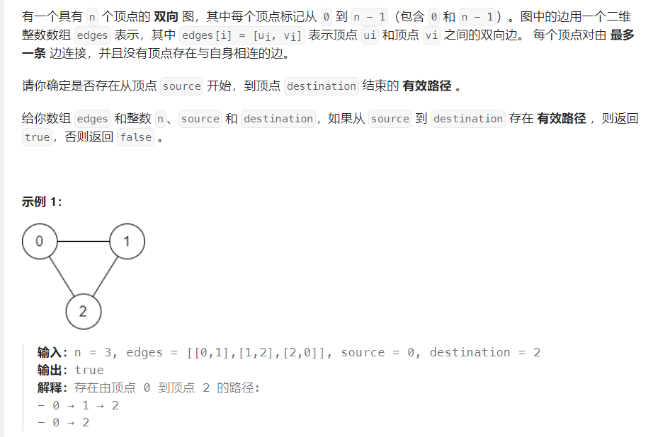

# 并查集

适合用于检查两个元素是否属于一个集合，以及两个元素之间是否有连通路径（连通路径还可以用广度优先搜索和深度优先搜索来查）。
一个例子：

<center>



</center>

```cpp
class UnionFind {
public:
    UnionFind(int n) {
        parent = vector<int>(n);
        rank = vector<int>(n);
        for (int i = 0; i < n; i++) {
            parent[i] = i;
        }
    }

    void uni(int x, int y) {
        int rootx = find(x);
        int rooty = find(y);
        if (rootx != rooty) {
            if (rank[rootx] > rank[rooty]) {
                parent[rooty] = rootx;
            } else if (rank[rootx] < rank[rooty]) {
                parent[rootx] = rooty;
            } else {
                parent[rooty] = rootx;
                rank[rootx]++;
            }
        }
    }

    int find(int x) {
        if (parent[x] != x) {
            parent[x] = find(parent[x]);
        }
        return parent[x];
    }

    bool connect(int x, int y) {
        return find(x) == find(y);
    }
private:
    vector<int> parent;
    vector<int> rank;
};

class Solution {
public:
    bool validPath(int n, vector<vector<int>>& edges, int source, int destination) {
        if (source == destination) {
            return true;
        }
        UnionFind uf(n);
        for (auto edge : edges) {
            uf.uni(edge[0], edge[1]);
        }
        return uf.connect(source, destination);
    }
};
```