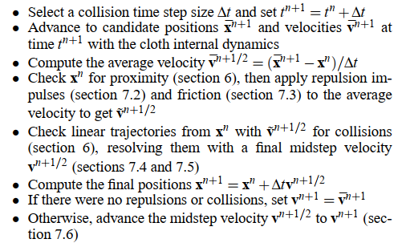

# 碰撞处理简介

碰撞检测之后，我们希望让物体回到合法的位置，主要有两种处理的思路：

## 内点法（Interior Point Methods）

## 论文中的方法

- 首先宽检测，对距离近的去做一个排斥力处理，减少碰撞的发生，排斥力要限制大小，不能直接在单帧内推出重叠区域
- 排斥力分为非弹性（防止碰撞）和弹性（用于模拟布料压缩）
- 排斥力用于生成摩擦
- 以上产生冲量用于修正速度，接下来开始检测时间步长中的碰撞
- 如果还有碰撞产生，那就正常处理
- 对碰撞自碰撞用Rigid Impact Zone，将碰撞的片元放入一个列表（Impact Zone）中，列表中的东西当做刚体进行模拟。这样做会让布料冻起来一样不真实，但是基于之前的排斥力和碰撞，经验表明Rigid Impact Zone会变得很小、孤立且低频，所以其实效果还好

