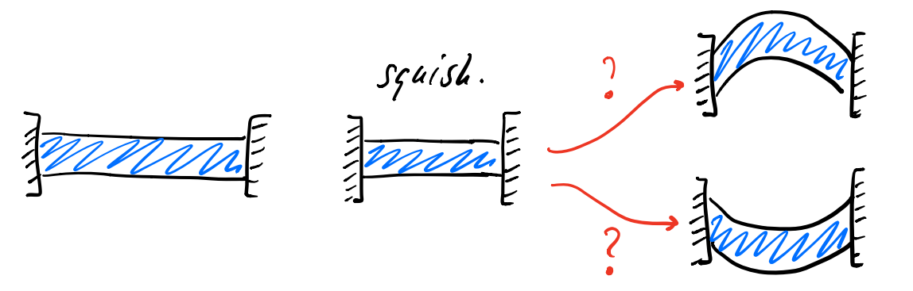

# 能量的特征值系统分析
> 参考论文：[1]Smith, B., F. D. Goes, and T. Kim (2018, March). Stable neo-hookean flesh simulation.
ACM Trans. Graph. 37(2). [2]Smith, B., F. D. Goes, and T. Kim (2019, February). Analytic eigensystems for isotropic distortion energies. ACM Trans. Graph. 38(1).

在[不变式构造本构模型并计算Hessian](./invariants.md)一文中，我们通过不变式重新构建了本构模型的能量密度函数，并且使用不变式的梯度和Hessian构建了能量密度函数Hessian的计算通式。但是光是计算Hessian还没有完，现在很多物理仿真过程使用的都是PCG（预处理共轭梯度法）求解器，该类求解器要求线性系统中的系统矩阵$\bf A$是一个半正定矩阵，也即$\bf A$的所有特征值都是大于等于零的。如果不满足这个条件，那么在求解的过程中就可能同时出现多个物理可行、能量一致的解，而求解器并不知道该选哪一个：

但是由于线性系统中的矩阵${\bf A}$的维度足足有$3n\times3n$，分析起来还是很麻烦的，所以我们可以尝试对每一个四面体（element）的能量密度的平坦化Hessian，即$\operatorname{vec}\left(\frac{\partial^2 \Psi}{\partial {\bf F}^2}\right)\in\mathbb{R}^{9\times9}$去做特征值分解，然后将小于零的特征值投影到0上来解决这个问题。

参考论文研究得到：
- 任意能量密度的Hessian的特征值都可以用不变式来进行表示
- 能量密度的Hessian的特征矩阵可以使用不变式的Hessian的特征矩阵来表示

下面直接给出结论。

## 能量密度的特征值
任意能量密度的Hessian的特征值有六个可以用十分简单紧凑的表达式得到：
$$
\begin{aligned}
    \lambda_0&=\frac{2}{\sigma_x+\sigma_y}\frac{\partial \Psi}{\partial I_1}+2\frac{\partial \Psi}{\partial I_2}+\sigma_z\frac{\partial \Psi}{\partial I_3}\\
    \lambda_1&=\frac{2}{\sigma_y+\sigma_z}\frac{\partial \Psi}{\partial I_1}+2\frac{\partial \Psi}{\partial I_2}+\sigma_x\frac{\partial \Psi}{\partial I_3}\\
    \lambda_2&=\frac{2}{\sigma_x+\sigma_z}\frac{\partial \Psi}{\partial I_1}+2\frac{\partial \Psi}{\partial I_2}+\sigma_y\frac{\partial \Psi}{\partial I_3}\\
    \lambda_3&=2\frac{\partial \Psi}{\partial I_2}-\sigma_z\frac{\partial \Psi}{\partial I_3}\\
    \lambda_4&=2\frac{\partial \Psi}{\partial I_2}-\sigma_x\frac{\partial \Psi}{\partial I_3}\\
    \lambda_5&=2\frac{\partial \Psi}{\partial I_2}-\sigma_y\frac{\partial \Psi}{\partial I_3}.
\end{aligned}
$$
后三个特征值则需要构造一个$3\times3$的矩阵$\bf A$，$\bf A$的特征值即为能量密度的Hessian的后三个特征值。矩阵$\bf A$是这样构造的：
$$
\begin{aligned}
    a_{ij}&=\sigma_k\frac{\partial \Psi}{\partial I_3}+\frac{\partial^2\Psi}{\partial I_1^2}+4\frac{I_3}{\sigma_k}\frac{\partial^2 \Psi}{\partial I_2^2}+\sigma_kI_3\frac{\partial^2 \Psi}{\partial I_3^2}+2\sigma_k(I_2-\sigma_k^2)\frac{\partial^2\Psi}{\partial I_2 \partial I_3}+(I_1-\sigma_k)\left(\sigma_k\frac{\partial^2\Psi}{\partial I_3\partial I_1}+2\frac{\partial^2 \Psi}{\partial I_1\partial I_2}\right)\\
    a_{ii}&=2\frac{\partial\Psi}{\partial I_2}+\frac{\partial^2\Psi}{\partial I_1^2}+4\sigma_i^2\frac{\partial^2\Psi}{\partial I_2^2}+\frac{I_3^2}{\sigma_i^2}\frac{\partial^2\Psi}{\partial I_3^2}+4\sigma_i\frac{\partial^2\Psi}{\partial I_1\partial I_2}+4I_3\frac{\partial^2\Psi}{\partial I_2\partial I_3}+2\frac{I_3}{\sigma_i}\frac{\partial^2\Psi}{\partial I_3\partial I_1}
\end{aligned}
$$
如果有时候运气好，这个矩阵$\bf A$正好是一个对角阵（例如Symmetric Dirichlet能量的情况），那么就可以直接将$a_{ii}$的公式当作特征值拿来用。

## 能量密度的特征矩阵
同样的，对于前六个特征值所对应的特征矩阵，它们分别为：
$$
\begin{aligned}
    {\bf Q}_0=\frac{1}{\sqrt{2}}{\bf U}\begin{bmatrix}
        0&-1&0\\1&0&0\\0&0&0
    \end{bmatrix}{\bf V}^T \qquad &
    {\bf Q}_1=\frac{1}{\sqrt{2}}{\bf U}\begin{bmatrix}
        0&0&0\\0&0&1\\0&-1&0
    \end{bmatrix}{\bf V}^T \qquad &
    {\bf Q}_2=\frac{1}{\sqrt{2}}{\bf U}\begin{bmatrix}
        0&0&1\\0&0&0\\-1&0&0
    \end{bmatrix}{\bf V}^T \\
    {\bf Q}_3=\frac{1}{\sqrt{2}}{\bf U}\begin{bmatrix}
        0&1&0\\1&0&0\\0&0&0
    \end{bmatrix}{\bf V}^T \qquad &
    {\bf Q}_4=\frac{1}{\sqrt{2}}{\bf U}\begin{bmatrix}
        0&0&0\\0&0&1\\0&1&0
    \end{bmatrix}{\bf V}^T \qquad &
    {\bf Q}_5=\frac{1}{\sqrt{2}}{\bf U}\begin{bmatrix}
        0&0&1\\0&0&0\\1&0&0
    \end{bmatrix}{\bf V}^T 
\end{aligned}
$$
后面三个特征值对应的特征矩阵为：
$$
{\bf Q}_{i\in\{6,7,8\}}=\sum_{j=0}^2z_j{\bf D}_j \qquad \text{where} 
\left \{ 
\begin{aligned}
    &z_0=\sigma_x\sigma_z+\sigma_y\lambda_i\\
    &z_1=\sigma_y\sigma_z+\sigma_x\lambda_i\\
    &z_2=\lambda_i^2=\sigma_z^2
\end{aligned}    
\right.
$$
其中，矩阵${\bf D}_j$为：
$$
{\bf D_0}={\bf U}\begin{bmatrix}
        1&0&0\\0&0&0\\0&0&0
    \end{bmatrix}{\bf V}^T \qquad
{\bf D_1}={\bf U}\begin{bmatrix}
        0&0&0\\0&1&0\\0&0&0
    \end{bmatrix}{\bf V}^T \qquad
{\bf D_2}={\bf U}\begin{bmatrix}
        0&0&0\\0&0&0\\0&0&1
    \end{bmatrix}{\bf V}^T
$$

不过话说回来，为什么要算特征矩阵呢？不是只要把所有负的特征值映射到上就可以了么？是因为我们在映射之后还需要使用特征值和特征矩阵组合起来得到新的能量密度的Hessian去参与线性系统的解算。重组Hessian的公式为:
$$
\operatorname{vec}\left(\frac{\partial {\bf R}}{\partial {\bf F}}\right)=
\sum_{i=0}^2\lambda_i\operatorname{vec}({\bf Q}_i)\operatorname{vec}({\bf Q}_i)^T
$$