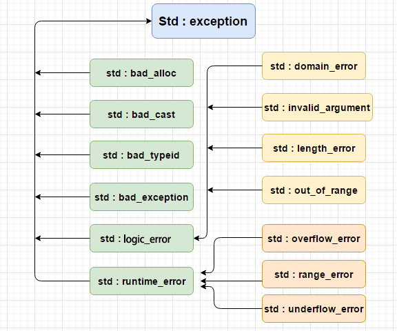

# 异常
异常是程序在执行期间产生的问题。C++ 异常是指在程序运行时发生的特殊情况，比如尝试除以零的操作。

异常处理这一块主要涉及到了三个关键字：**try**、**catch**、**throw**：
- throw: 当问题出现时，程序会抛出一个异常。这是通过使用 throw 关键字来完成的。
- catch: 在您想要处理问题的地方，通过异常处理程序捕获异常。catch - 关键字用于捕获异常。
- try: try 块中的代码标识将被激活的特定异常。它后面通常跟着一个或多个 catch 块。

其中 try 和 catch 必须一起用，try 块中放入可能抛出异常的代码，这一块的代码被称为**保护代码**。使用 try/catch 语句的语法如下所示：

```cpp
try
{
   // 保护代码
}catch( ExceptionName e1 )
{
   // catch 块
}catch( ExceptionName e2 )
{
   // catch 块
}catch( ExceptionName eN )
{
   // catch 块
}
```

catch 能够捕获到 try 块中使用 throw 抛出的异常。如果 try 块在不同的情境下会抛出不同的异常，这个时候可以尝试罗列多个 catch 语句，用于捕获不同类型的异常。

异常一般使用 &lt;exception&gt; 中的 std::exception。但是也可以是自己定义的数据结构，然后在 catch 块中进行一些自定义操作，例如：

```cpp
#include <iostream>
using namespace std;
 
double division(int a, int b)
{
   if( b == 0 )
   {
      throw "Division by zero condition!";
   }
   return (a/b);
}
 
int main ()
{
   int x = 50;
   int y = 0;
   double z = 0;
 
   try {
     z = division(x, y);
     cout << z << endl;
   }catch (const char* msg) {
     cerr << msg << endl;
   }
 
   return 0;
}
```

## C++ 标准的异常
C++ 提供了一系列标准的异常，定义在 &lt;exception&gt; 中，我们可以在程序中使用这些标准的异常。它们是以父子类层次结构组织起来的，如下所示：

<center>



</center>

| 异常	|  描述 |
| :----- | :----- |
| std::exception | 该异常是所有标准 C++ 异常的父类。 |
| std::bad_alloc | 该异常可以通过 new 抛出。 |
| std::bad_cast | 该异常可以通过 dynamic_cast 抛出。|
| std::bad_typeid | 该异常可以通过 typeid 抛出。|
| std::bad_exception | 这在处理 C++ 程序中无法预期的异常时非常有用。 |
| std::logic_error | 理论上可以通过读取代码来检测到的异常。 |
| std::domain_error | 当使用了一个无效的数学域时，会抛出该异常。 |
| std::invalid_argument | 当使用了无效的参数时，会抛出该异常。 |
| std::length_error | 当创建了太长的 std::string 时，会抛出该异常。 |
| std::out_of_range | 该异常可以通过方法抛出，例如 std::vector。 | 
| std::runtime_error | 理论上不可以通过读取代码来检测到的异常。 |
| std::overflow_error | 当发生数学上溢时，会抛出该异常。 |
| std::range_error | 当尝试存储超出范围的值时，会抛出该异常。 |
| std::underflow_error | 当发生数学下溢时，会抛出该异常。 |

## 定义新的异常
通过继承 std::exception 来实现自己的异常类，只需要重写 what 函数即可

```cpp 
#include <iostream>
#include <exception>
using namespace std;
 
struct MyException : public exception
{
  const char * what () const throw ()
  {
    return "C++ Exception";
  }
};
 
int main()
{
  try
  {
    throw MyException();
  }
  catch(MyException& e)
  {
    std::cout << "MyException caught" << std::endl;
    std::cout << e.what() << std::endl;
  }
  catch(std::exception& e)
  {
    //其他的错误
  }
}
```