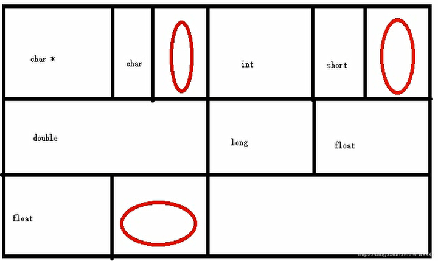

# 类和结构体的内存排布

首先给出基本的内置类型在内存中存储时占用的内存。

| Type | x86 | x64 |
|:---- |:----|:----|
| 指针 | 4 | 8 |
| char | 1 | 1 |
| int | 4 | 4 |
| short | 2 | 2 |
| long | 4 | 4 |
| long long | 8 | 8 |
| float | 4 | 4 |
| double | 8 | 8 |
| long double | 8 | 8 |

类和结构体的内存对齐结构是按照成员中的最大字节数来存储的。若类或结构体中最大的基本内置数据类型占8个字节，那么类或结构体存储的内存中按照8个字节位一格进行存储，将其他较少字节数的数据往里填，若有空余，则看下一个数据能否填入；若不能，则按照内存对齐原则，从下一格开始填入数据，空余的内存则被跳过。

例如：（其中的`struct`可以替换成`class`）
```cpp
struct stus{
    char *p;            //4
    char arr[2];        //1*2
    int c;              //4
    short d;            //2
    double f;           //8
    long g;             //4
    float h[2];         //4*2
};
```
可以看到这里最大的数据类型是8。**注意**，是 double 的8，而不是 float[2] 的8，因为在内存中 `float h[2];`其实和`float h0; float h1;`是一样的。
那么这个类/结构体的内存排布为：

<center>



</center>

其中红色圈是空余的内存，整个类/结构体占内存位 5*8=40 字节。

如果结构体和类之间出现了嵌套，那么编译器会将嵌套结构完全拆散成内置数据类型构成的一个类/结构体，然后进行内存排布，例如：

```cpp
struct A {
    int a;
    double b;
    int c;
};

struct B {
    int d;
    A e;
    int f;
}
```

可以看到 B 结构体中嵌套了一个结构体 A。那么在编译器看来，在内存排布的时候结构体 B 其实是这样的：

```cpp
struct AandB {
    int d
    int a;
    double b;
    int c;
    int f;
}
```
所以最长的内置数据类型长度为8。那么 B 的长度就是 $3\times8=24$ 吗？**不是的**，经过测试，拆开之后的结构只能用于判断对齐长度。但是在上面的代码中，d和a、f和c分别是属于 B 和 A 的成员，它们之间是不允许挤在一起放在一个格子里的，即无法让d和a（c和f）构成一个八字节，最终实现$3\times8=24$ 的结构。而应该是 $5 \times 8 = 40$。

## 为什么要内存对齐？
因为大多数处理器是2个字节、4个字节、甚至更多的字节为单位来存取内存。如果没有内存对齐机制，假如有一个 int 类型的变量放在地址为1的连续4个字节地址中。当处理器获取数据时，它会先从0地址开始读4个字节，然后剔除不想要的字节，再从4地址开始，读取4个字节，再提出不想要的字节，最后再将剩余数据合并。

所以说，内存对齐后可以增加我们访问数据时候的效率。