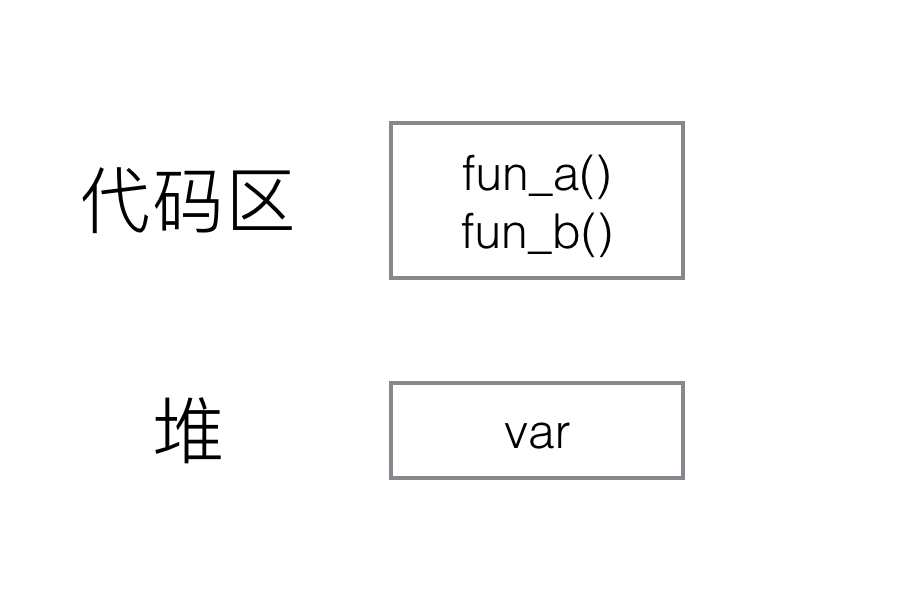
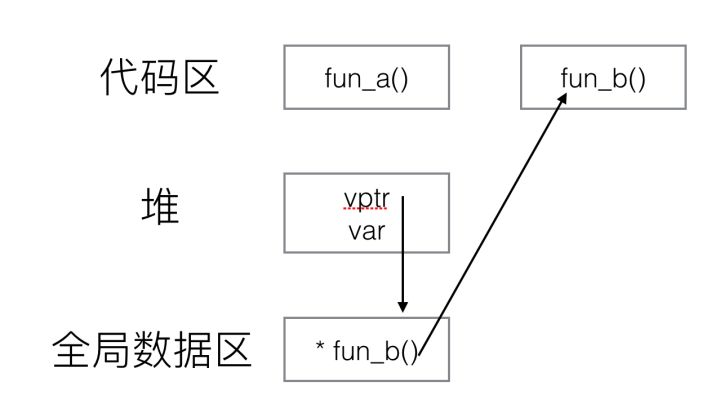
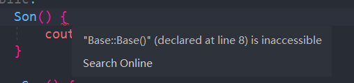
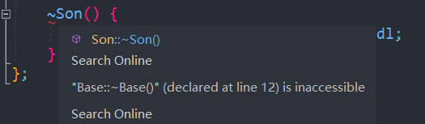

# 多态和虚函数表
最近连续几次面试都问了这个问题，于是将其记录到博客中。

## 什么是多态
“多态”（polymorphism），是指计算机程序运行时，相同的消息可能会送给多个不同的类别之对象，而系统可依据对象所属类别，引发对应类别的方法，而有不同的行为。简单地来说，就是“在用父类指针调用函数时，实际调用的是指针指向的实际类型（子类）的成员函数”。多态性使得程序调用的函数是在运行时动态确定的，而不是在编译时静态确定的。

举例：
```cpp
class Base {
public:
    virtual void vir_func() { cout << "virtual function, this is base class!" << endl; }
    void func() { cout << "normal function, this is base class!" << endl; }
}

class A : public Base {
    virtual void vir_func() { cout << "virtual function, this is A class!" << endl; }
    void func() { cout << "normal function, this is A class!" << endl; }
}

class B : public Base {
    virtual void vir_func() { cout << "virtual function, this is B class!" << endl; }
    void func() { cout << "normal function, this is B class!" << endl; }
}

int main() {
    Base* base = new Base();
    Base* a = new A();
    Base* b = new B();
    base->func(); 
    a->func();
    b->func();
    cout << "========================================" << endl;
    base->vir_func();
    a->vir_func();
    b->vir_func();
}
```

代码运行的结果为：
```
normal function, this is base class!
normal function, this is base class!
normal function, this is base class!
========================================
virtual function, this is base class!
virtual function, this is A class!
virtual function, this is B class!
```

总结一下上面的规律：**当使用基类的指针调用成员函数的时候，普通函数由指针的类型来决定，虚函数由指针指向的实际类型决定**。这个功能是通过虚函数表来实现的。

## 虚函数表

解释虚函数表的原理之前，先介绍一下类的内存分布，对于一个不包含静态变量和虚函数的类：
```cpp
class noVir{
public:
    void func_a();
    void func_b();
    int var;
}
```
它的内存分布是这样的：



其中成员函数放在代码区，为该类的所有对象**公有**，即不管新建多少个该类的对象，所对应的都是同一个函数存储区的函数。而成员变量则为各个对象所**私有**，即每新建一个对象都会新建一块内存区用来存储var值。在调用成员函数时，程序会根据类的类型，找到对应代码区所对应的函数并进行调用。在文章开头的例子中，base、a、b都是Base类型的指针。调用普通函数时，程序根据指针的类型到类Base所对应的代码区找到所对应的函数，所以都调用了类Base的func函数，即指针的类型决定了普通函数的调用。

而带有虚函数的类的内存分布是这样的：
```cpp
class withVir{
public:
    void func_a();
    virtual void func_b();
    int var;
}
```


如果使用`sizeof(withVir)`可以发现，withVir类会比noVir类大四个字节，多出来的这部分内容就是指针`vptr`，该指针叫做**虚函数表指针**，它指向一个名为**虚函数表**（vtbl）的表。
虚函数表实际上一个数组，数组里面的每个元素都是一个函数指针。上例中，虚函数表里就存储了虚函数`func_b()`具体实现所对应的位置。虚函数表在编译的时候由编译器生成。

注意，普通函数（代码区）、虚函数（代码区）、虚函数表（常量区/只读数据段）都是同一个类的所有对象公有的，只有成员变量和虚函数表指针是每个对象私有的，sizeof的值也**只包括**`vptr`和var所占内存的大小，并且`vptr`通常会在对象内存的最起始位置。

不论一个类中有多少个虚函数，类的实例中也只会有一个`vptr`指针，增多虚函数，变化的是该类所对应的虚函数表的长度，即其中所存储的指向虚函数的函数指针的数量。

那么可以总结出虚函数的实现原理：**通过对象内存中的vptr找到虚函数表vtbl，接着通过vtbl找到对应虚函数的实现区域并进行调用**。如开头例子中，当调用vir_func函数时，分别通过base、a、b指针找到对应的`vptr`，然后找到各自的虚函数表vtbl，最后通过vtbl找到各自虚函数的具体实现。所以虚函数的调用时由指针所指向内存块的具体类型决定的。

## 构造函数和析构函数可以是虚函数吗？
给出结论：**构造函数不能是虚函数，析构函数可以是、且推荐写为虚函数**。

为什么构造函数不能是虚函数？我们已经知道虚函数的实现则是通过对象内存中的`vptr`来实现的。而构造函数是用来实例化一个对象的，通俗来讲就是为对象内存中的值做初始化操作。那么在构造函数完成之前，`vptr`是没有值的，也就无法通过`vptr`找到作为虚函数的构造函数所在的代码区，所以构造函数只能作为普通函数存放在类所指定的代码区中。

为什么析构函数推荐最好设置为虚函数？如文章开头的例子中，当我们delete(a)的时候，如果析构函数不是虚函数，那么调用的将会是基类Base的析构函数。而当继承的时候，通常派生类会在基类的基础上定义自己的成员，基类的析构函数并不知道派生类中有什么新的成员，自然也无法将它们的内存释放，所以说析构函数会被推荐写为虚函数。

## 构造函数和析构函数的调用顺序
构造函数：先基类，再子类

析构函数：先子类，再基类

```cpp
class Base {
public:
	Base() {
		cout << "Create Base class" << endl;
	}

	~Base() {
		cout << "Destory Base class" << endl;
	}
};

class Son : public Base {
public:
	Son() {
		cout << "Create Son class" << endl;
	}

	~Son() {
		cout << "Destory Son class" << endl;
	}
};


int main() {
	Son s;
	return 0;
}
```

输出为:
```shell
Create Base class
Create Son class
Destory Son class
Destory Base class
```

如果将父类的构造函数和析构函数放进 private 里，那么子类的构造函数和析构函数就会出现报错：

<center>





</center>

## 三种继承方式
当一个类派生自基类，该基类可以被继承为 public、protected 或 private 几种类型。继承类型是通过上面讲解的访问修饰符 access-specifier 来指定的。

我们几乎不使用 protected 或 private 继承，通常使用 public 继承。当使用不同类型的继承时，遵循以下几个规则：

- 公有继承（public）：当一个类派生自公有基类时，基类的公有成员也是派生类的公有成员，基类的保护成员也是派生类的保护成员，基类的私有成员不能直接被派生类访问，但是可以通过调用基类的公有和保护成员来访问。
- 保护继承（protected）： 当一个类派生自保护基类时，基类的公有和保护成员将成为派生类的保护成员。
- 私有继承（private）：当一个类派生自私有基类时，基类的公有和保护成员将成为派生类的私有成员。

## 多继承
多继承即一个子类可以有多个父类，它继承了多个父类的特性。

C++ 类可以从多个类继承成员，语法如下：

```cpp
class <派生类名>:<继承方式1><基类名1>,<继承方式2><基类名2>,…
{
<派生类类体>
};
```

### 多继承带来的问题
1. 构造函数的执行顺序

```cpp
#include <iostream>

class Father {
public:
    Father () {std::cout << "Father constructed !" << std::endl;}
};

class Mother {
public:
    Mother() {std::cout << "Mother constructed !" << std::endl;}
};

class Son : public Mother, public Father {
public:
    Son() {std::cout << "Son constructed !" << std::endl;}
};

int main()
{
    Son son;
    std::cin.get();
}
```
输出结果是：
```shell
Mother constructed !
Father constructed !
Son constructed !
```
多继承中，定义派生类对象时，构造函数的执行顺序和派生类定义时继承的顺序保持一致。

2. 基类中同名变量冲突

在上面的例子中，加入 Father 和 Mother 中都有一个变量 name。那么在派生类中直接使用`son.name`是会出现报错的，必须要在变量名前面加上作用域`son.Mother::name`。

3. 内存布局（多态、虚函数表指针）
对于下面的代码：
```cpp
#include <iostream>
#include <string>

class Father {
public:
    Father ()
    {
        std::cout << "Father constructed !" << std::endl;
    }
    virtual void Func() {}
    virtual void Func2(){}
    void Func3() {}
};

class Mother {
public:
    Mother()
    {
        std::cout << "Mother constructed !" << std::endl;
    }
    virtual void Func() {};
};

class Son : public Mother, public Father {
public:
    Son() {std::cout << "Son constructed !" << std::endl;}
};

int main()
{
    Father father;
    std::cout << sizeof(father) << std::endl;
    Mother mother;
    std::cout << sizeof(mother) << std::endl;
    Son son;
    std::cout << sizeof(son) << std::endl;
    std::cin.get();
}
```
输出结果是：
```shell
Father constructed !
4
Mother constructed !
4
Mother constructed !
Father constructed !
Son constructed !
8
```
可以发现，Father 对象和 Mother 对象占4字节，而派生类 Son 的对象占用了8个字节，这是因为：
- 如果一个类中没有任何数据成员，那么它所占的内存是 1 字节
- Father 和 Mother 对象中因为有虚函数，所以各自还有一个虚表指针（__vfptr），所以各自为4字节
- 在多继承场景中，派生类会存在多个虚表指针，分别指向从 Father 和 Mother 中继承过来的虚函数，所以 son 对象占8个字节。

4. 菱形继承

两个派生类继承同一个基类，同时两个派生类又作为基本继承给同一个派生类。这种继承形如菱形，故又称为菱形继承。

菱形继承的问题：菱形继承主要有数据冗余和二义性的问题。由于最底层的派生类继承了两个基类，同时这两个基类有继承的是一个基类，故而会造成最顶部基类的两次调用，会造成数据冗余及二义性问题。
例如：
```cpp
class Person//人类
{
	public :
	string _name ; // 姓名
};
class Student : public Person//学生类
{
protected :
    int _num ; //学号
};
class Teacher : public Person//老师类
{
protected :
    int _id ; // 职工编号
};
class Assistant : public Student, public Teacher//助理类
{
protected :
    string _majorCourse ; // 主修课程
};
void Test ()
{
    // 这样会有二义性无法明确知道访问的是哪一个
    Assistant a ;
    a._name = "peter";
    
    // 需要显示指定访问哪个父类的成员可以解决二义性问题，但是数据冗余问题无法解决
    a.Student::_name = "xxx";
    a.Teacher::_name = "yyy";
}
```

使用**虚拟继承**可以解决菱形继承的问题

## 虚拟继承
虚拟继承可以解决菱形继承的二义性和数据冗余的问题，其作用是在间接继承共同基类时只保留一份基类成员。
回到上面的例子，如果 Student 和 Teacher 在继承 Person 的时候使用虚拟继承，就可以解决问题。

```cpp
class Person
{
public :
    string _name ; // 姓名
};
class Student : virtual public Person
{
protected :
    int _num ; //学号
};
class Teacher : virtual public Person
{
protected :
    int _id ; // 职工编号
};
class Assistant : public Student, public Teacher
{
protected :
    string _majorCourse ; // 主修课程
};
void Test ()
{

    Assistant a ;
    a._name = "peter";
}
```

在其他地方不要去使用虚拟继承。

虚继承的实现原理是，编译器在派生类的对象中添加一个指向虚基类实例的指针，用于指向虚基类的实例。这样，在派生类中对于虚基类的成员访问都通过这个指针进行，从而保证了虚基类的唯一性。