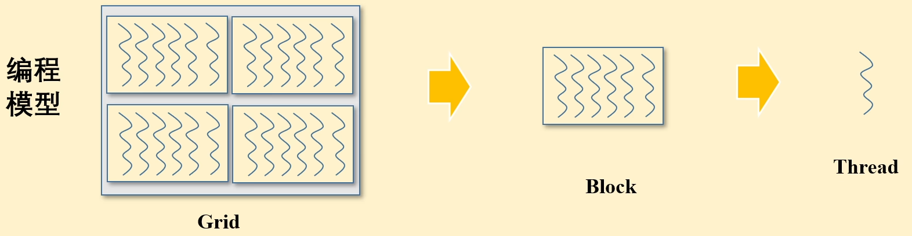
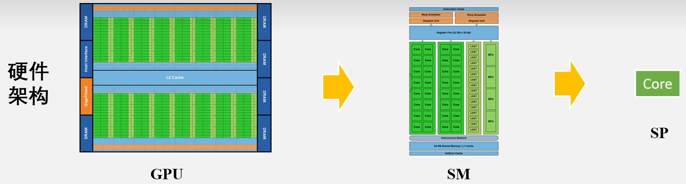
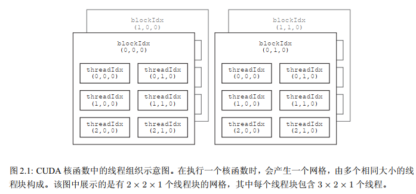

# CUDA的线程组织

## 调用核函数

CUDA程序中往往既有主机（CPU）代码也有设备（GPU）代码，主机对设备的调用通过核函数（kernel function）来实现，核函数被限定词`__global__`修饰，返回值必须为`void`，例如最简单的：
```cpp
// highlight-next-line
__global__ void hello_from_gpu() {
    // 核函数中不支持iostream
    printf("Hello Word from the GPU!\n");
}
```
在主机代码中调用上述核函数：
```cpp
int main(void) {
    // highlight-start
    hello_from_gpu<<<1, 1>>>();
    cudaDeviceSynchronize();
    // highlight-end
    return 0;
}
```
在标记处可以看到，在核函数的调用时使用了一个三括号`<<<1, 1>>>`，这是用来指明核函数中的线程数目以及排列情况的。
核函数中的线程常组织为若干线程块（thread block）：三括号中的第一个数字可以看作线程块的个数，第二个数字可以看作每个线程块中的线程数。一个核函数的全部线程块构成一个网格（grid），而线程块的个数就记为网格大小（grid size）。每个线程块中含有同样数目的线程，该数目称为线程块大小（block size）。
所以，核函数中总的线程数就等于网格大小乘以线程块大小，而三括号中的两个数字分别就是网格大小和线程块大小，即 `<<<网格大小, 线程块大小>>>`。
所以，在上述程序中，主机只
指派了设备的一个线程，网格大小和线程块大小都是 $1$，即 $1\times 1=1$。



这里的网格、线程块和线程大致与硬件结构中的GPU、SM（流式多处理器）和SP（流式处理器）一一对应：



调用核函数后，程序调用了一个CUDA运行时API函数`cudaDeviceSynchronize()`，该函数能够促使缓冲区刷新，从而将之前存放在缓冲区的输出流的内容输出出来。

## 多线程
一般来说，总的线程数大于计算核心数的时候才能够更充分地利用GPU中的计算资源，因为这会让计算和内存访问合理地重叠，从而减小计算核心空闲的时间。

通过改变网格大小（线程块数量）和线程块大小（单个块中线程数量）能够改变指派的线程数量。
核函数中代码的执行方式是“单指令-多线程：，即每一个线程都执行同一串指令。所以通过下述代码就可以在屏幕上打印8行同样的文字。
```cpp
hello_from_gpu<<<2, 4>>>();
```
**Tips：** 从开普勒架构开始，最大允许的线程块大小是1024，一维网格的最大允许的网格大小是$2^{31}-1$。虽然一个核函数允许指派的线程数目是巨大的，但是执行时能够同时活跃的线程数是由硬件（CUDA核心数）和软件（核函数中的代码）共同决定的。所以为了高效率的运行代码，除了指派足够的线程，还需要一些写核函数的技巧。

## 线程索引
每个线程在核函数里都有一个唯一的身份标识，该身份标识由两个参数决定：
- `blockIdx.x`：这个变量代表一个当前线程在一个网格中所属于的线程块的编号，取值范围是[0, gridDim.x-1]。`gridDim.x`即之前指派的网格大小。
- `threadIdx.x`：这个变量代表一个当前线程在所属于的线程块中的编号，取值范围是[0, blockDim.x-1]。`blockDim.x`即之前指派的线程块大小。

## 推广到多维网格
从之前索引中出现的`.x`应该就可以猜到，之前的定义的网格都是一维的结构。并且`gridDim`、`blockIdx`、`blockDim`和`threadIdx`都是结构体。

`blockIdx`和`threadIdx`的类型为`uint3`，该类型为一个结构体，具有x、y、z三个成员，其定义为：
```cpp
struct __device_builtin__ uint3 {
    unsigned int x, y, z;
};
typedef __device_builtin__ struct uint3 uint3
```

`gridDim`和`blockDim`的类型为`dim3`，该类型也为一个结构体，具有x、y、z三个成员，并且还包括了一些成员函数。

在之前的例子中，我们使用的`执行配置`只使用了两个整数，这两个这整数的值会分别赋给内建变量`gridDim.x`和`blockDim.x`，其他未被指定的成员则默认为1。这个情况下，网格和线程块都是一维的。我们可以给`dim3`的三个成员全部赋值然后实现多维的网格和线程块：
```cpp
//任何未被指定的成员都会默认为1
dim3 grid_size(Gx, Gy, Gz);
dim3 block_size(Bx, By, Bz);
```

多维的网格和线程块本质还是一维的（和数组一样），我们可以这样计算出一个线程的一维编号（在线程块中）：
```cpp
int tid = threadIdx.z * blockDim.x * blockDim.y +
            threadIdx.y * blockDim.x + threadIdx.x;
```
这里需要注意，这样的一维编号定义并不能扩展到一维线程块中去，因为各个线程块的执行是相互独立的。



对于不同的代码需求，有时候可能会需要不同的符合线程索引。

**Tips：** CUDA中对能够定义的网格大小和线程块大小做了限制，对任何从开普勒到安培架构的GPU来说，网格大小在x、y、z这3个方向上的最大允许值分别为$2^{31}-1$、$65535$和$65535$。线程块在x、y、z这3个方向上的最大允许值分别为1024、1024和64，并且要求线程块的总大小，即`blockDim.x`、`blockDim.y`和`blockDim.z`的乘积不能大于1024。

## 线程束（thread warp）
一个线程块还可以细分成多个线程束，一个线程束（也就是一束线程）是一个线程块里面相邻的`warpSize`个线程。`warpSize`也是一个内建变量，其值对于目前所有的GPU架构都是32。所以，一个线程束就是连续的32个线程。

一般来说，希望线程块的大小是`warpSize`的整数倍，否则系统会自动为剩下的n个线程补齐32-n个线程，形成一个完整的线程束，而这32-n个线程并不会被核函数调用，从而闲置。
