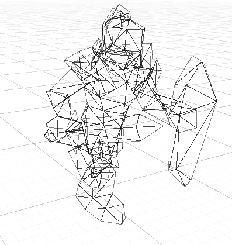
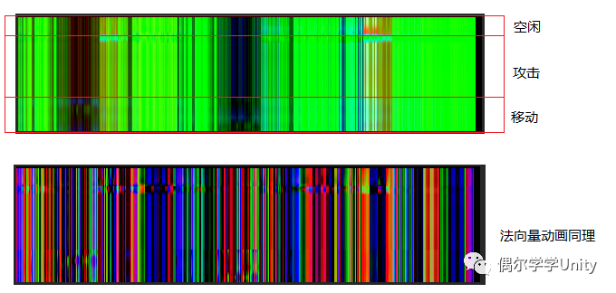
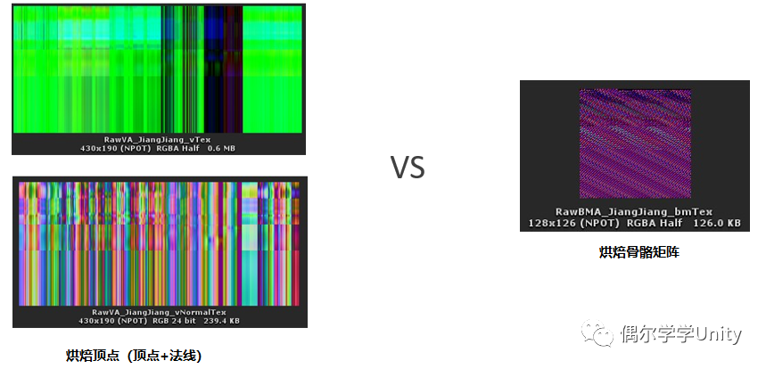

# 优化骨骼蒙皮动画

## 骨骼蒙皮动画的流程
主要可以分为以下几个阶段：
- **播放动画阶段：**动画控制器会根据关键帧信息等，调整骨骼的空间属性（旋转、缩放、平移）
- **计算骨骼矩阵阶段：**从根骨骼开始，根据层级关系，逐一计算出每一根骨骼的转换矩阵
- **蒙皮阶段：**更新网格上每个顶点的属性。网格的顶点根据权重被骨骼影响，游戏中一般一个顶点被最多四个骨骼影响
- **渲染阶段：**当顶点变换到角色坐标系下后，就可以进行渲染了。这里与一次普通的渲染没什么太大差别，唯一需要注意的是，Unity不会对蒙皮网格渲染器进行合批，所以每一个骨骼蒙皮动画实例都至少需要一次DrawCall

这其中的各个阶段都带来一定的负载，有两种主流的优化方案：**烘焙顶点动画**和**烘焙骨骼矩阵动画**。他们的基本思路都是将骨骼蒙皮动画的结果余弦保存在一张**纹理**中，然后在运行时通过 GPU 从这张纹理中采样，并且使用采样接过来更新顶点属性；再结合实例化（GPU Instancing）来达到高效、大批量渲染的目的。

## 烘焙顶点动画
可以简单的将它的工作流程分为两个阶段：
- 非运行状态下的烘焙阶段
- 运行状态下的播放阶段

### 烘焙阶段
主要思路即：使用一个表来记录每一个顶点在每一个关键帧时的位置表，然后在播放阶段的时候进行读取顶点的位置并进行更新，就等于完成了蒙皮工作。使用这种方式来更新角色动画，其实是直接使用了预先处理好的骨骼动画、蒙皮网格渲染器的作用结果，是一种用空间换时间的策略。

那么为了便于 GPU 读取顶点位置表，我们可以将数据保存为一张纹理，比如，对于一个拥有505个顶点的模型来说，我们可以将表表中的信息保存到一张 512 x Height 大小的纹理中。

这其中，纹理的宽度用来表示顶点的数量，而纹理的高度用来表示关键帧，所以Height的值取决于动画长度以及动画帧率。

由于动画播放时，顶点的实时位置是从纹理中采样，而非从网格中读取的（不再使用蒙皮网格渲染器，顶点缓冲区内的数据不会被修改），所以顶点属性中的法线信息也无法使用了（永远是静止状态下的）；如果需要获取正确的法向量，那就需要在烘焙顶点坐标时也同样将法线烘焙下来，并在顶点变换阶段将这个法向量也采样出来。

如果存在多个动画（例如空闲、移动、攻击），如果每一个动画都烘焙两个纹理（顶点位置和法向量），那贴图的数量很快就会不受控制。
鉴于所有动画对应的顶点数量一致，也就是纹理的宽度都相同，我们可以将多个动画纹理进行合并。

### 动画播放阶段
我们通过UV坐标来获取这张纹理上的像素，就可以被理解为：取第U个顶点在第V帧时的坐标。在播放动画时，CPU将当前播放的关键帧传给顶点着色器；顶点着色器计算出对应的V坐标；结合顶点索引及动画纹理的宽度计算出U，既可采样出这个顶点基于角色坐标系下的坐标；接下来用这个坐标再进行后面的空间变换就可以了。

### 动画过渡
简单的动画过渡很容易实现，只要在切换动画时，分别计算出当前动画和下一个动画的播放位置，然后传给GPU进行两次顶点位置采样，再对两次采样的结果进行插值即可。

### 使用实例化渲染
实例化渲染的特点是使用**相同网格**，**相同材质**，通过不同的实例属性完成大批量的带有一定差异性的渲染；而烘焙顶点恰好符合了实例化渲染的使用需求。

所以，我们只需将控制动画播放的关键属性：比如过渡动画播放的V坐标、当前和下一个动画的插值比例等，放入实例化数据数组中进行传递；再在顶点着色器中，对关键属性获取并使用即可。

### 与传统方法比较
- 不再需要CPU计算动画和蒙皮，提升了性能
- 可以通过实例化技术批量化渲染角色，减少DrawCall

### 烘焙顶点的主要问题
- 模型顶点数量受限：如果纹理的最大尺寸限制在2048 x 2048，那么只能烘焙下顶点数在2048个以下的模型
- 记录顶点动画的纹理过大
- 存储的动作长度有限

## 烘焙骨骼矩阵
除了烘焙顶点，另一种常用的优化方案是烘焙骨骼矩阵动画。

### 烘焙阶段
听名字就知道，烘焙骨骼矩阵与烘焙顶点位置，原理十分相似；最大的差异在于它们在烘焙时所记录的内容不一样：烘焙顶点记录下来的是每个顶点的位置，而烘焙骨骼矩阵记录下来的是每一根骨骼的矩阵，仅此而已。

烘焙骨骼矩阵最大的意义在于它补上了烘焙顶点的短板：受顶点数量限制、烘焙的动画纹理过大 及 纹理数量较多，因为骨骼的数量很少。
在移动平台上，通常20根左右的骨骼就可以取得不错的表现效果，所以相对于烘焙顶点，烘焙骨骼可以记录下更长的动画，同时它也不再受顶点数量的限制，也无需对法线或切线进行特殊处理（因为可以在采样后通过矩阵计算得出）。

:::tips

1. 烘焙骨骼矩阵记录的是每根骨骼的ComponentSpace矩阵
2. 需要将每个顶点与骨骼的关系记录到网格信息中，这个关系是指顶点会被哪根骨骼影响（骨骼索引）以及影响的大小（权重值）
3. 对于不同的骨骼动画，烘焙矩阵的方式也不一定相同，例如，如果骨骼动画中每根骨骼只会相对于上层骨骼进行旋转变换，那我们烘焙一个四元数就够了

:::

### 播放阶段
播放阶段烘焙骨骼矩阵的方法会比烘焙顶点动画要多一些计算。例如，在烘焙阶段将完整的矩阵保存在三个像素中，那转换的时候就需要采样三次才能拼凑出一个完整的矩阵。（每个像素四个数据，RGB+Alpha）