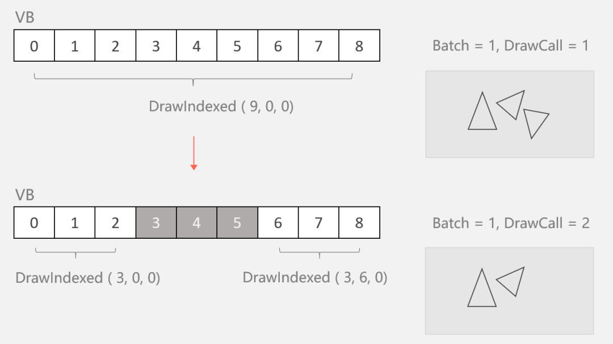

# 关于DrawCall

DrawCall 是在性能优化的时候经常讨论到的东西，DrawCall 过多会导致 CPU 需要组装很多渲染指令，准备很多数据，当超过一定数量后，会导致 CPU 与 GPU 通信出现瓶颈，影响性能。所以一般来说会需要用批量渲染（“合批”）技术，通过减少CPU向GPU发送渲染命令（DrawCall）的次数，以及减少GPU切换渲染状态的次数，尽量让GPU一次多做一些事情，来提升逻辑线和渲染线的整体效率。

:::tip

不过这种做法是在GPU算力没有被充分利用，而CPU把更多的时间都耗费在渲染命令的提交上时，才有意义。如果瓶颈在GPU，比如GPU性能偏差，或片段着色器过于复杂等，那么没准适当减少批处理，反而能达到优化的效果。当然，通常情况下，确实是以CPU出现瓶颈更为常见。

:::

## 静态合批
静态合批可以分为预处理阶段的合并和运行阶段的批处理。

### 合并阶段
将符合合批条件的网格取出，对网格上的顶点进行空间变换，变换到合并根节点的坐标系下，再合并成一个新的网格。

这样做的**目的**是为了“固化”顶点缓冲区和索引缓冲区内的数据，使其顶点位置等信息都在相同的坐标系下。这样运行时如果需要对合并后的对象进行空间变换（手动静态合批对象的根节点可被空间变换），则无需修改缓冲区内的顶点属性，只提供根节点的变换矩阵即可。

但是合并后会膨胀场景文件，会在一定程度上影响场景的加载时间，另一方面，不同平台对于合并的顶点和索引数量有限制，超过这个限制就会合并成多个新网格

### 批处理阶段
如果使用相同的材质，那么在运行时就可以合批成功。手动修改材质和修改渲染器使用的网格（不再使用合批后的大网格）都会打断批处理。

### 小Tips
一次静态合批，并不表示一定只有一次 DrawCall 命令的调用。

合并发生后，每个参与合批的网格信息（顶点、索引等）就会被最终确定，不再被修改。当一个参与合并的单位不显示时，如被设置为隐藏或被视椎体剔除，引擎并不会修改顶点缓冲区和索引缓冲区的内容，而会拆分若干个小的 DrawCall 来分次渲染。通过调整每个 DrawCall 的索引（起始索引、索引个数）来跳过不应该被显示的单位。

所以也可以看见静态合批和直接使用大网格是不一样的。

其一，态合批在运行时，由于每个参与合并的对象可以通过起始索引等彼此区分，因此可以通过上述多次DrawCall的策略，实现隐藏指定的对象；而直接使用大网格，则无法做到这一点。

其二，静态合批可以有效参与CPU的视锥剔除。当有剔除发生时，被送进渲染管线的顶点数量就会减少（通过参数控制），也就意味着被顶点着色器处理的顶点会减少，提升了GPU的效率；而使用大网格渲染时，由于整个网格都会被送进渲染管线，因此每一个顶点都需要被顶点着色器处理，如果摄像机只能照到一点点，那么绝大多数参与计算的顶点最后都会被裁减掉，有一些浪费。

  

### 优缺点
静态合批采用了以空间换时间的策略来提升渲染效率。

其优势在于：网格通常在预处理阶段（打包）时合并，运行时顶点、索引信息也不会发生变化，所以无需CPU消耗算力维护；若采用相同的材质，则以一次渲染命令，便可以同时渲染出多个本来相对独立的物体，减少了DrawCall的次数。
在渲染前，可以先进行视锥体剔除，减少了顶点着色器对不可见顶点的处理次数，提高了GPU的效率。

其弊端在于：合批后的网格会常驻内存，在有些场景下可能并不适用。比如森林中的每一棵树的网格都相同，如果对它采用静态合批策略，合批后的网格基本等同于：单颗树网格 x 树的数量，这对内存的消耗可能就十分巨大了。

总而言之，静态合批在解决场景中材质基本相同、网格不同、且自始至终都保持静止的物体上时，很适用。

## 动态合批
动态合批没有像静态合批打包时的预处理阶段，它指挥在程序运行时发生。主要用于处理一些模型简单、材质相同、处在运动下的物体。

动态合批会在每次绘制前，先将可以合批的对象整理在一起，然后将它们的网格信息进行合并，接着仅向 GPU 发送一次绘制指令，就可以完成它们整体的绘制。

### 小Tips
1. 动态合批不会在绘制前创建新的网格，只是将参与合批的顶点属性连续填充到一块顶点和索引缓冲区中，让 GPU 认为它们是一个整体
2. 合批前，由于这些对象可能属于不同的父节点，所以需要在送进渲染管线前将每个顶点的坐标转换为世界坐标系下的坐标。

### 动态合批的条件
动态合批要求：
- 材质球相同
- Mesh顶点数量不能超过300以及顶点属性不能超过900
- 缩放不能为负值（x、y、z向量的乘积不能为负）等

### 和静态合批的差别：
1. 动态合批不会创建常驻内存的“合并后网格”，也就是说它不会在运行时造成内存的显著增长，也不会影响打包时的包体大小
2. 动态合批在绘制前会先将顶点转换到世界坐标系下，然后再填充进顶点、索引缓冲区；静态合批后子网格不接受任何变换操作，仅手动合批后的Root节点可被操作，因此静态合批的顶点、索引缓冲区中的信息不会被修改（Root的变换信息则会通过Constant Buffer传入）
3. 因为2的原因，动态合批的主要开销在于遍历顶点进行空间变换时的对CPU性能的开销；静态合批没有这个操作，所以也没有这个开销
4. 动态合批使用根据渲染器类型分配的公共缓冲区，而静态合批使用自己专用的缓冲区。

## 实例化渲染
很多场景中往往存在大量重复性的元素：树木、草和岩石。
它们都使用了相同的模型，或者模型的种类很少，比如：树可能只有几种；但为了做出差异化，它们的颜色略有不同，高低参差不齐，当然位置也各不相同。

使用静态合批来处理它们（假设它们都没有动画），是不合适的。因为数量太多了，所以合并后的网格体积可能非常大，这会引起内存的增加；而且，这个合并后的网格还是由大量重复网格组成的，不划算。

使用动态合批来处理他们，虽然不会“合并”网格，但是仍然需要在渲染前遍历所有顶点，进行空间变换的操作；虽然单颗树、石头的顶点数量可能不多，但由于数量很多，所以也会在一定程度上增加CPU性能的开销，没必要。

对于场景中这些模型重复、数量众多的渲染需求，可以使用实例化渲染的方法来解决这个问题。

### 工作原理
实例化渲染，是通过调用“特殊”的渲染接口，由GPU完成的“批处理”。

它与传统的渲染方式相比，最大的差别在于：调用渲染命令时需要告知GPU这次渲染的次数（绘制N个）。当GPU接到这个命令时，就会连续绘制N个物体到我们的屏幕上，其效率远高于连续调用N次传统渲染命令的和（一次绘制一个）。

举个例子，假设希望在屏幕上绘制出两个颜色、位置均不同的箱子。如果使用传统的渲染，则需要调用两次渲染命令（DrawCall = 2），分别为：画一个红箱子 和 画一个绿箱子。如果使用实例化渲染，则只需要调用一次渲染命令（DrawCall = 1），并且附带一些参数2（表示绘制两个）、两个箱子各自的位置（矩阵）、颜色即可。

### 与静态、动态合批的差异
静、动态合批实质上是将可以合批的对象真正的合并成一个大物体后，再通知GPU进行渲染，也就是其顶点索引缓冲区中必须包含全部参与合批对象的顶点信息；因此，可以认为是CPU完成的批处理。
本质上讲：动、静态合批解决的是合批问题，也就是先有大量存在的单位，再通过一些手段合并成为批次。

而实例化渲染其实是个复制的事儿，是对网格信息的重复利用，从少量复制为大量，只是利用了它“可以通过传入属性实现差异化”的特点，在某些条件下达到了与合批相同的效果。

## 方法的选择
如果你的场景中存在多数静止的、使用了不同网格、相同材质的物体，特别是当你的相机通常只能照到一部分物体时（如第一视角），可以优先尝试下静态合批，通过牺牲一些内存来提升渲染效率；

针对那些运动的、网格顶点数很少、材质相同的物体，比如飞行的各种箭矢、炮弹等，使用动态合批，通过增加一些CPU处理顶点的性能开销，来提升渲染效率，也许是不错的选择；

如果有大量模型相同、材质相同、或尽管表现上有一些不同，但仍然可以通过属性来实现这些差异化的物体时，启用实例化渲染通常可以在很大程度上提升渲染效率。