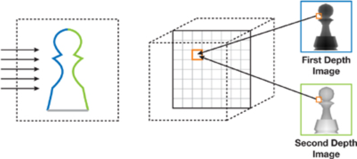

# [GPU Gems 3笔记] Part V-1: Real-Time Rigid Body Simulation on GPUs

## 刚体模拟基础

刚体运动主要包括位移和旋转两个部分。其中位移非常简单，就是质心的移动。当一个力$F$作用在一个刚体上，这会引起其动量(linear momentum)$P$的变化，具体地：

$$
\frac{dP}{dt} = F.
$$

根据动量可以获得速度：

$$
v = \frac{P}{M}
$$

关于旋转，这个力$F$作用在刚体上同样也会带来角动量(angular momentum)$L$的变化，具体地：

$$
\frac{dL}{dt} = r \times F
$$
其中$r$是力的作用点和质心的相对位置。

根据角动量可以获得角速度$\omega$：
$$
\omega = I(t)^{-1}L
$$
其中$I(t)^{-1}$是刚体在时间t的惯性张量，它是一个$3\times3$的矩阵。惯性张量是会随着刚体的姿态变化的，所以我们需要在每一个仿真步长对其进行更新。而具体到每个时间t的惯性张量的力，可以用下式得到：

$$
I(t)^{-1} = R(t)I(0)^{-1}R(t)^T
$$

其中$R(t)$是时间t时旋转矩阵，一般来说我们会使用四元数来存储旋转，所以这一步需要一些转换。而四元数的计算可以由角速度得到：

$$
dq = [\operatorname{cos}(\theta/2), a\cdot \operatorname{sin}(\theta / 2)]
$$

其中$a=\omega/|\omega|$是旋转轴，$\theta = \omega t$是旋转角。

### 刚体形状表达

为了加速碰撞运算，本文选择使用一系列粒子来表示刚体。

具体做法：首先使用3D体素来近似的表示这个rigidbody（通过划分3D网格），然后在每一个体素放一个粒子。这个生成过程可以在GPU中进行加速，首先打一组平行光到刚体上，光线到刚体上的第一个交点构成了一个深度图，第二个交点构成了第二个深度图。那么很明显第一个深度图就表示刚体正面，第二个深度图表示刚体的反面。那么我们将体素作为输入，通过检测这些体素的深度，哪些体素的深度在两个深度图之间，哪些体素就在刚体内，那么就可以在这里生成一个粒子。

### 碰撞检测
将刚体用粒子进行表示之后，碰撞检测就被简化为了粒子之间的碰撞检测。这样有一个好处就是碰撞检测很简单，另一个好处就是碰撞检测的精度和速度都是可控的，如果要更大的精度，就可以调小粒子半径，如果要更快的速度就可以用更大的粒子半径。

另一方面，可以使用空间哈希来进行优化，通过选择合适的网格大小，能够让计算效率最大化，一般来说网格的边长是粒子的半径的两倍。

### 碰撞响应
粒子之间的碰撞力使用离散元（DEM）方法计算得到，这是一种用于计算颗粒材料的方法。粒子之间的斥力$f_{i,s}$由一个线性弹簧进行模拟，阻尼力$f_{i,d}$用一个阻尼器来进行模拟。对于一组碰撞粒子i和j，这些力的计算方法如下：

$$
f_{i,s} = -k(d-|r_{ij}|)\frac{r_{ij}}{|r_{ij}|}\\
f_{i,d}=\eta v_{ij}
$$
其中的$k,\eta,d,r_{ij},v_{ij}$分别是弹簧弹性系数，阻尼系数，粒子直径，粒子的相对位置和相对速度。
同时还可以模拟剪切力，它与相对切向速度$v_{ij,t}$成正比：
$$
f_{i,t}=k_tv_{ij,t}
$$
其中这个相对切向速度的计算方法为：
$$
v_{ij,t}=v_{ij}-\left(v_{ij}\cdot\frac{r_{ij}}{|r_{ij}|}\right)\frac{r_{ij}}{|r_{ij}|}
$$
通过将力累积就可以获得作用与当前刚体的碰撞力和力矩：
$$
F_c = \sum_{i\in RigidBody}(f_{i,s}+f_{i,d}+f_{i,t})\\
T_c = \sum_{i\in RigidBody}(r_i\times (f_{i,s}+f_{i,d}+f_{i,t}))
$$
其中$r_i$是当前粒子i相对刚体质心的相对位置。

## GPU上的刚体模拟
