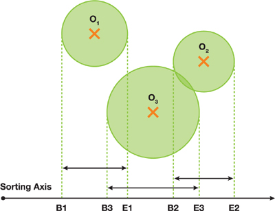
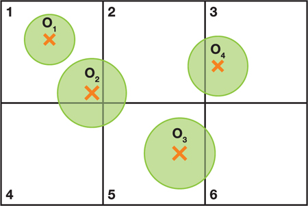
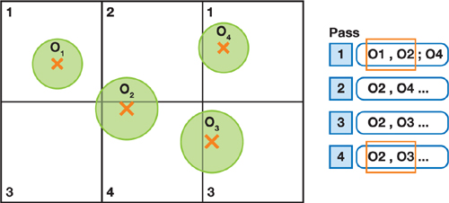

# [GPU Gems 3笔记] Part V-4: Broad-Phase Collision Detection with CUDA

## 常用Broad-Phase碰撞检测算法

### Sort and Sweep
将各个物体的Bounding Volume投影到x、y或者z轴上，在各个轴上生成一个一维碰撞区间$[b_i,e_i]$。如果这个碰撞区间在三个轴上都没有相交，那么就不可能产生碰撞。具体的检测过程可以对碰撞区间进行排序来完成。很适合用于静态场景的检测。

### Spatial Subdivision
空间哈希，一般来说网格会比最大的那个物体要大一些。通过选择一个合适的网格大小，对一个物体，就只需要检测他所在的网格以及与其相邻的网格。如果场景中的物体大小差别巨大，那就效率就会降低。
在比较理想的情况下，碰撞检测仅在以下情况才会进行：物体i和物体j出现在同一个网格中，并且至少有一个物体的中心点也在这个网格中时，才会进行碰撞检测。

### Parallel Spatial Subdivision
并行化会使算法变得稍微复杂。

第一个复杂之处在于，如果单个对象与多个网格重叠且这些网格被并行处理，那么该对象可能同时参与多个碰撞测试。因此，必须存在某种机制，以防止两个或多个计算线程同时更新同一对象的状态。为了解决这个问题，我们需要控制每个网格的大小（大于最大物体的bounding volume），由于每个网格的大小至少与计算中最大对象的边界体积相同，因此只要在计算过程中处理的每个网格都与同一时间处理的其他网格至少相隔一个网格，就可以保证每个对象只有一个包含它的网格会被更新。
在2D中，这意味着需要进行四个计算过程来覆盖所有可能的网格；在3D中，需要进行八个过程。

