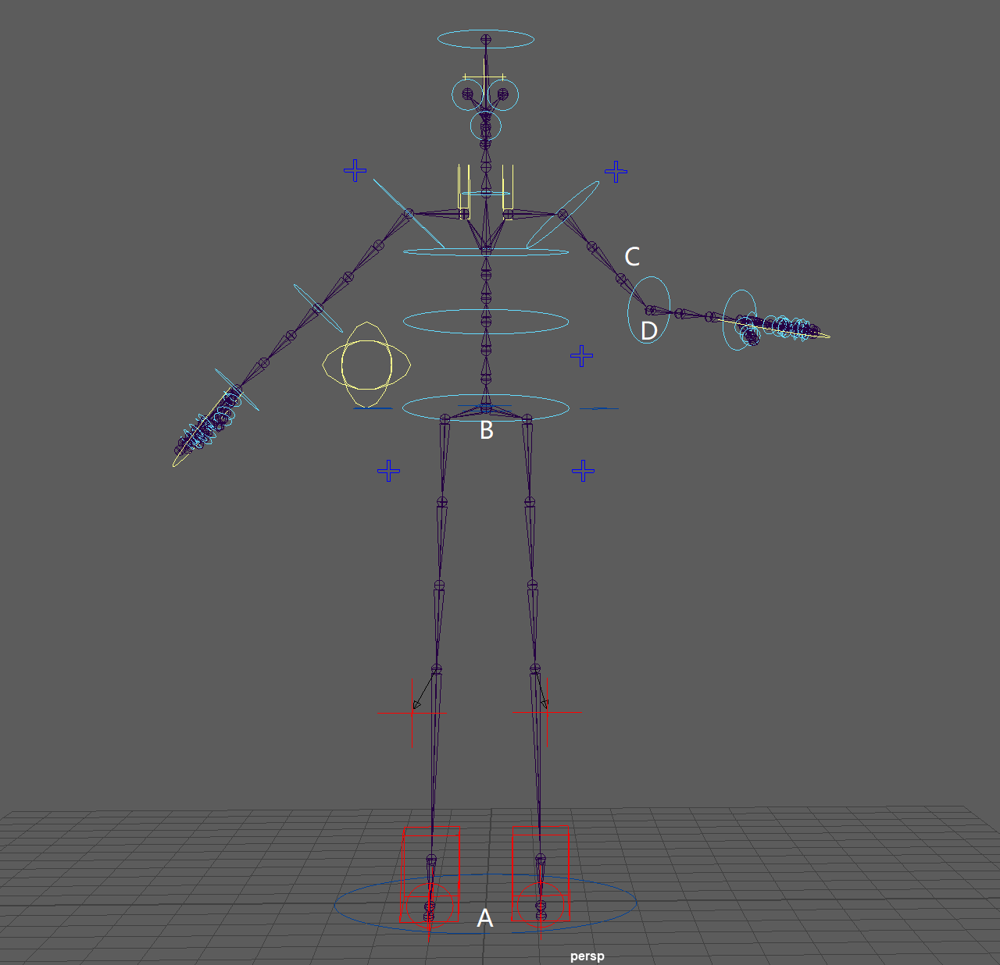

# Joint Solver 整体框架
如果说每一个Joint Solver都是C++中的一个类的话，那么其整体框架就是一个基类，接下来讲解一下这个基类需要一些什么成员。

## 成员变量
求解器需要求解每一个关节的位置和旋转，旋转一般用一个三维数组表示，旋转用一个四元数来表示，可以使用一个vector来存储所有joint的位置和旋转。
另外在求解约束或者处理碰撞的时候可能需要做一些substep，同样我们也需要仿真的时间步长以及一个用于substep处理的插值（权重）系数alpha。
最后，我们需要一个抽象层来帮助我们对仿真场景中的所有数据进行读写操作。
所以框架中需要这些成员变量：
```cpp
vector<VECTOR3> _jointPositions;
vector<QUAT>    _jointRotations;
int             _subStep;
float           _deltaT;
float           _alpha;
DataInterface*  _dataInterface;
```

:::tip Space

这里简要介绍一下三种空间的表示方法，可以参考[知乎-UE的骨骼与空间变换](https://zhuanlan.zhihu.com/p/437835421)：
- 世界空间(World Space)：以世界原点为原点的坐标系描述的空间，描述物体的绝对Transform信息，在UE的编辑器中ActorTransform都是在World Space下的；
- 本地空间(Local Space)：顾名思义，关节的本地空间，即以父节点为原点的坐标系描述的空间；
- 组件空间(Component Space)：UE中的每个网格是以组件为载体的，组件空间是以组件的根节点为原点的坐标系描述的空间。
  
参考下面这个图：

A点是世界坐标原点，B是骨架的根节点，C是手肘关节节点的父节点，D是手肘关节节点。我们考虑D的变换，那么有：
- D相对A的变换就是世界空间下的变换
- D相对C的变换就是本地空间下的变换
- D相对B的变换就是组件空间下的变换

需要注意，全文所有求解过程都是在组件空间下完成的。

:::

## 成员函数
### 初始化 `Init()`
首先需要对求解器去做一个初始化，在基类中需要初始化的内容不多，将成员变量赋初始值/分配容量就行。由于不同的求解器可能有不同的属性要进行初始化，所以应当被声明为虚函数。
```cpp
virtual void Init() {
    _jointPosition.resize(_dataInterface->GetJointNumber());
    _jointRotations.resize(_dataInterface->GetJointNumber());
    _subStep = _dataInterface->GetSubStep();
}
```
`_alpha`在什么地方初始化？

### 初始化Transform `InitTransform()`
接下来在求解之前，首先我们要获得当前骨架中各个骨骼的位置和旋转信息，赋值给Joint Solver的成员变量。
```cpp
void InitTransform() {
    for (int jointIndex = 0; jointIndex < jointNumber; jointIndex++) {
        _jointPositions[jointIndex] = _dataInterface->GetInputJointPosition(jointIndex);
        _jointRotations[jointIndex] = _dataInterface->GetInputJointRotation(jointIndex);
    }
}
```

### 重置约束 `ResetConstrains()`
然后根据在`InitTransform()`中更新的骨架初始位置和旋转对场景中存在的各个约束进行重置。另外，在重置约束的时候，可能时间步长也是需要的信息之一。
```cpp
void ResetConstrains() {
    for (int constrainIndex = 0; constraintIndex < constraintNumber; constraintIndex++) {
        _dataInterface->GetConstrain(constrainIndex)->Reset(_jointPositions, _jointRotations, _deltaT);
    }
}
```

### 隐式求解 `SolveImpl()`
接下来就可以直接开始求解得到新的位置和旋转了，这一块就需要具体的求解器，即框架的子类，来具体实现了，我们一般可以定义其为纯虚函数。
```cpp
virtual void SolveImpl() = 0;
```

### 为约束和碰撞求解做准备 `PrepareSubStep()`
和模拟里面的思路类似，首先先计算得到了一个单次更新的位置和旋转之后，就可以进行碰撞和约束求解（碰撞也定义为一种约束）了。
那么在进行subStep的计算之前，首先要做一些准备，之前的求解中，我们只计算并且更新了骨架中的骨骼的位置和旋转，接下来我们要在这里一并把骨骼上附加的碰撞体也去做对应的位置和旋转的更新。

更新的过程主要是遍历场景中所有的碰撞体，然后记录下这个碰撞体在时间步长开始前、以及`SolveImpl`之后的碰撞体的Transform，然后使用alpha进行插值，获得在当前这个subStep的Transform估计值，以参与后续的碰撞和约束相关的运算。

各个求解器可能会在该函数中做一些其他运算，所以定义为虚函数。
```cpp
virtual void PrepareSubStep() {
    for (int colliderIndex = 0; colliderIndex < colliderNumber; colliderIndex++) {
        Transform colliderTransform, preColliderTransform;
        Collider* collider = _dataInterface->GetCollider(colliderIndex);
        // 在设置骨骼的碰撞体的时候，该碰撞体本身可能就会有一个和骨骼之间的relative transform
        // 所以在collider中会设置一个变量attachOffsetTransform，将这个relative transform给记录下来
        // 同样，collider中也会有一个变量attachBoneIndex来记住它所依附的骨骼的编号
        colliderTransform = collider->attachOffsetTransform * 
                            _dataInterface->GetJointTransform(collider->attachBoneIndex);
        preColliderTransform = collider->attachOffsetTransform * 
                            _dataInterface->GetInputJointTransform(collider->attachBoneIndex);
        // 插值，找到对应的时刻的Transform, _alpha在Solve中进行计算
        colliderTransform = Lerp(colliderTransform, preColliderTransform, 1.0 - _alpha);
    }
}
```

### 求解约束 `SolveConstrains()`
接下来就要对约束进行求解了，遍历每个约束然后计算求解即可，各个求解器可能会在该函数中做一些其他运算，所以定义为虚函数。
```cpp
virtual void SolveConstrains() {
    for (int constrainIndex = 0; constraintIndex < constraintNumber; constraintIndex++) {
         _dataInterface->GetRegularConstrain(constrainIndex)->SolveConstrain(_dataInterface, _jointPositions, _jointRotations, _deltaT);
    }
}
```

在函数中我们还为Constrain提供了数据的接口`_dataInterface`，这是因为约束需要对包括joint的位置和旋转等数据进行读写操作，所以我们需要将接口交给它（类似权限交接，暂时给予）。

### 求解碰撞约束 `SolveCollisions()`
碰撞也是一类约束，所以操作和约束求解一样，遍历每个约束然后计算求解即可，各个求解器可能会在该函数中做一些其他运算，所以定义为虚函数。
```cpp
virtual void SolveCollisions() {
    for (int constrainIndex = 0; constraintIndex < constraintNumber; constraintIndex++) {
         _dataInterface->GetCollisionConstrain(constrainIndex)->SolveConstrain(_dataInterface, _jointPositions, _jointRotations, _deltaT);
    }
}
```

### 更新subStep相关数据 `UpdateBySubStep()`
TODO....
基类中无实现，定义为虚函数在子类中重写，但是因为不是必须环节，所以不是纯虚函数。
```cpp
void UpdateBySubStep() {}
```

### 更新关节的变换 `UpdateJointTransforms()`
之前的计算都只算出了新的joint位置和旋转，而并没有计算出最终的变换，我们在本函数中进行Transform的更新。

这里主要注意一点，在Solver的结算过程中，为了让求解过程更加简化和自由，我们并没有考虑各个节点之间的连接关系，所以在这个函数中很重要的一个点就是维持各个节点之间的连接关系，具体请看代码的实现。
```cpp
// 首先用一个新变量将之前的求解结果全部存储下来
vector<Transform> newJointTransforms(_dataInterface->GetJointNumber(), Transform::Identity);
for (int jointIndex = 0; jointIndex < JointNumber; jointIndex++) {
    newJointTransforms[jointIndex].SetTranslation(_jointPositions[jointIndex]);
    newJointTransforms[jointIndex].SetRotation(_jointRotations[jointIndex]);
}

// 接下来开始恢复骨架节点之间的连接关系
// 首先以关节中的链为单位，定位到链结构中的骨骼节点
int chainNumber = _dataInterface->GetChainNumber();
for (int chainIndex = 0; chainIndex < chainNumber; chainIndex++) {
    int chainLength = _dataInterface->GetChainLength(chainIndex);
    for (int chainNodeIndex = 0; chainNodeIndex < chainLength; chainNodeIndex++) {
        int jointIndex = _dataInterface->GetChainNodeIndex(chainIndex, chainNodeIndex);
        // 接下来找到定位到的节点的子节点（如果该节点是多个链的根节点怎么办？）
        int childIndex = _dataInterface->GetChild(jointIndex);
        Transform jointTransform = _dataInterface->GetJointTransform(jointIndex);
        
        // 如果joint已经是叶节点了，没有需要恢复的东西，开始其他链的修正
        if (childIndex == -1)
            continue;
        
        // 找到子节点的初始变换
        Transform childTransform = _dataInterface->GetJointTransform(childIndex);

        // 找到更新后，joint-child链的旋转关系
        VECTOR vecBefore = chileTransform.GetTranslation() - jointTransform.GetTranslation();
        VECTOR vecAfter = newJointTransform[childIndex].getTranslation() - newJointTransform[jointIndex].getTranslation();
        QUAT parentRotation = QUAT::FindBetween(vecBefore, vecAfter);

        // 更新组件空间的旋转，恢复链接关系
        jointTransform.setRotation(parentRotation * newJointTransform[jointIndex].getRotation());
        jointTransform.setTranslation(newJointTransform[jointIndex].GetTranslation());

        // 应用更新
        newJointTransform[jointIndex] = jointTransform;
    }
}

// 将newJointTransform中的信息更新到Simulation中的信息里面去
for (int jointIndex = 0; jointIndex < JointNumber; jointIndex++) {
    Transform jointTransform = newJointTransform[jointIndex];
    _dataInterface->SetJointTransform(jointIndex, jointTransform);
    // 用作下一步迭代的输入
    _dataInterface->SetInputJointTransform(jointIndex, jointTransform);
}
```

到这里需要的功能基本都实现了，接下来使用一个`Solve()`来包装前边的内容，让求解的流程有一个更清晰的逻辑链。

### 求解 `Solve()`
基本的逻辑如下：
```cpp
void Solve() {
    InitTransform();
    ResetConstrains();
    SolveImpl();

    for (int i = 0; i < _subStep; i++) {
        // 终于到了，alpha的更新公式
        _alpha = (i + 1.0f) / _subStep;
        PrepareSubStep();
        SolveConstrains();
        SolveCollisions();
    }

    if (_subStep > 1)
        UpdateSubStep();

    UpdateJointTransforms();
}
```