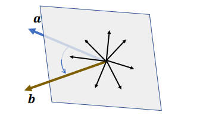
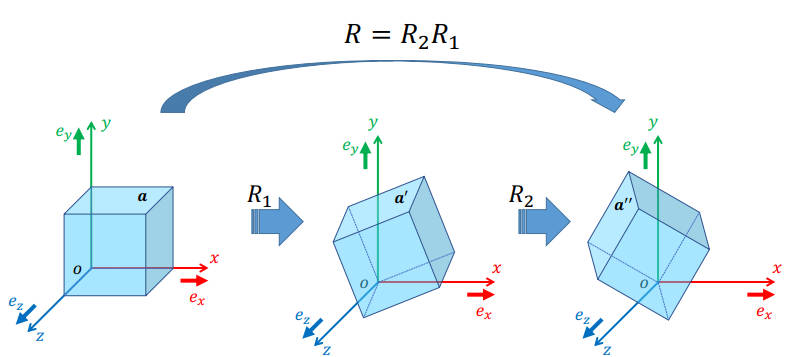
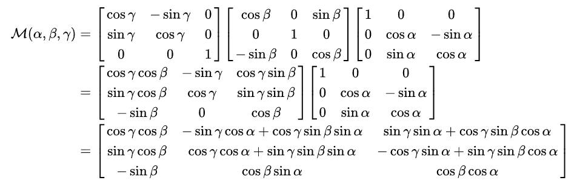
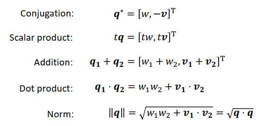
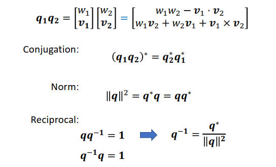
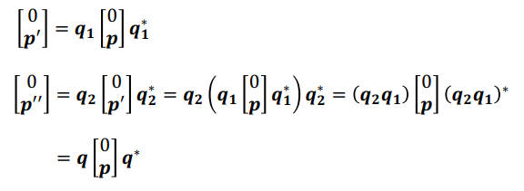

# 旋转

## 怎么找到两个向量之间的旋转？
向量间平分平面上的任意一个向量都可以当做旋转轴。

可以用下面的方法找到两个向量间的最小旋转的旋转轴 $u$ 和旋转角 $\theta$。
$$
u=\frac{a\times b}{||a\times b||},\quad \theta = \operatorname{argcos}\frac{a\cdot b}{||a||||b||}
$$

## 要怎么旋转一个向量？
可以使用多种方式表示的旋转来完成旋转：

### 旋转矩阵
旋转矩阵 $R$ 是一个正交矩阵，具有以下特点：
- $R^{-1} = R^T, R^TR=RR^T=I$
- 旋转矩阵的行列式为1
- 旋转矩阵不改变向量的长度 $||Rx||=||x||$

虽然说旋转矩阵中有9个值，但是在考虑到 $R^TR=I$ 和 $\operatorname{det}R=1$ 带来的约束之后，其实自由度就只剩下3了。

旋转矩阵不能使用 $(1 - t)R_0 + tR_t$ 的方式来进行插值。

### 欧拉角
任何旋转都可以表示为围绕xyz轴（一般指本地坐标系）的旋转的组合。

但是欧拉角的组合非常多，允许xyz不同的顺序，也可以绕相同的轴转多次：XYZ, XZY, YZX, YXZ, ZYX, ZXY, XYX, XZX, YXY, YZY, ZXZ, ZYZ。

但是欧拉角存在一个万向结死锁的问题：当两个本地坐标轴旋转到了平行的状态，那么就会丢失一个自由度。

欧拉角是可以进行线性插值的。

### 旋转轴、角
使用一个旋转轴 $u$ 和一个旋转角 $\theta$ 来表示旋转，具体地：
$$
x' = x + (\operatorname{sin}\theta)u\times x + (1 - \operatorname{cos}\theta)u\times(u\times x)
$$

旋转角可以非常方便地进行线性插值，但是在计算的时候，代码其实还是要将旋转角和旋转轴转换成矩阵。

### 四元数
四元数的形式为：$q=xi+yj+zk+w$，也可以写为：

$$
\boldsymbol{q}=\left[\begin{array}{l}
w \\
x \\
y \\
z
\end{array}\right]=\left[\begin{array}{l}
w \\
v
\end{array}\right]
$$

四元数的运算：

两个旋转相乘及其相关的运算：

四元数的四个元素的物理含义可以和旋转轴、角联系起来：
$$
\boldsymbol{q}=\left[\begin{array}{l}
w \\
x \\
y \\
z
\end{array}\right]=\left[\begin{array}{c}
\operatorname{cos}\frac{\theta}{2} \\
u.x\operatorname{sin}\frac{\theta}{2} \\
u.y\operatorname{sin}\frac{\theta}{2} \\
u.z\operatorname{sin}\frac{\theta}{2}
\end{array}\right]
$$

通过下面的公式就可以实现四元数对一个三维向量的旋转：
$$
\left[
    \begin{array}{c}
    0 \\
    p'
    \end{array}
\right]
=
q
\left[
    \begin{array}{c}
    0 \\
    p
    \end{array}
\right]
q^*
=
(-q)
\left[
    \begin{array}{c}
    0 \\
    p
    \end{array}
\right]
(-q^*)
$$

$q$ 和 $-q$ 表示的是同一个旋转。

对于多次旋转，有：

所以四元数是左乘，和矩阵一样。并且四元数可以线性插值。