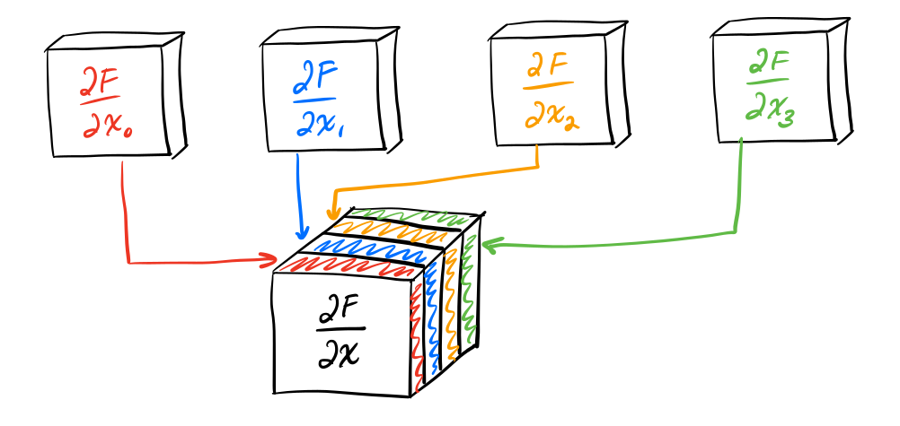
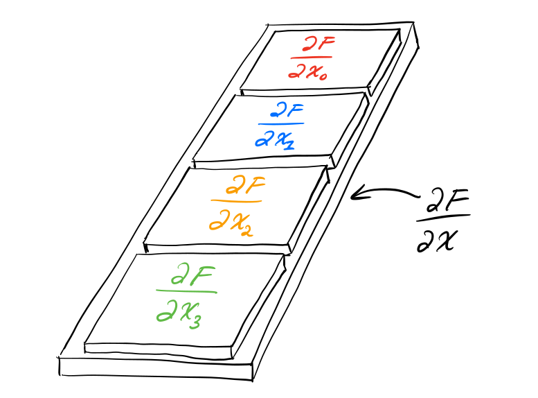
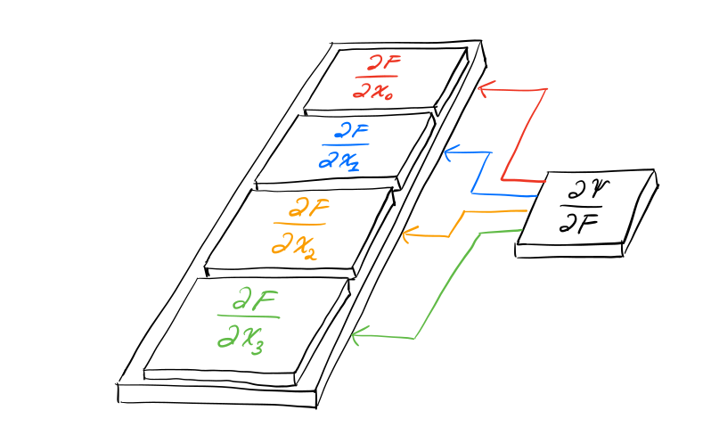

# 张量计算（以FEM中的场景为例）
> 本文主要参考自2021年的SIGGRAPH Course "Dynamic Deformables: Implementation and Production Practicalities"中的第三章"Computing Forces the Tensor Way"

在使用FEM的方法对弹性体进行模拟的时候，需要计算能量对位置的倒数取负数来获得力。此处定义能量密度为$\Psi\in\mathbb{R}$，形变梯度为${\bf F}\in\mathbb{R}^{3\times3}$，位置为${\bf x} \in \mathbb{R}^{12}$，那么能量密度对位置的偏导为：
$$
\frac{\partial \Psi}{\partial \bf x}=\frac{\partial \Psi}{\partial \bf F}\frac{\partial \bf F}{\partial \bf x}
$$

其中能量密度对形变梯度的偏导很好理解，其结果也是一个3x3的矩阵。
麻烦的是形变梯度对位置的偏导，即一个矩阵对向量的偏导。
形变梯度对位置中的每一个分量进行求导可以得到一个3x3的矩阵，那么完整的偏导就是12个3x3的矩阵的几何，这是一个三维张量，其维度为$\mathbb{R}^{3\times3\times12}$。

> 这里只展示了四个矩阵，实际上应该有12个

我们也可以将其视作一个由矩阵构成的向量，用我们更熟悉的二维的形式来表示三维张量：

> 这里只展示了四个矩阵，实际上应该有12个

从张量计算的角度出发，之前的计算公式可以重写为：
$$
\frac{\partial \Psi}{\partial \bf x}=\frac{\partial \bf F}{\partial \bf x}：\frac{\partial \Psi}{\partial \bf F}
$$
这里的“：”代表张量缩并。

:::danger 该重写方法仅适用于当前场景
该方法只是一个方便理解和代码实现的一个小技巧，并不是一个定理。据我现在的了解，目前这个结论只能够适用于`三维张量和二维矩阵`这一个场景中，实际情况需要实际分析，绝对不可以盲目套用！
:::

## 三维张量缩并（张量形式）
张量缩并是向量点积的推广，向量点积是：
$$
{\bf x}^T{\bf y}=
\begin{bmatrix}
x_0 \\ x_1 \\ x_2
\end{bmatrix}^T
\begin{bmatrix}
y_0 \\ y_1 \\ y_2
\end{bmatrix}=
x_0y_0+x_1y_1+x_2y_2
$$
矩阵缩并所做的事情也差不多：
$$
{\bf A}:{\bf B}=
\begin{bmatrix}
a_{00} & a_{01} \\
a_{10} & a_{11}
\end{bmatrix}:
\begin{bmatrix}
b_{00} & b_{01} \\
b_{10} & b_{11}
\end{bmatrix}=
a_{00}b_{00}+a_{01}b_{01}+a_{10}b_{10}+a_{11}b_{11}
$$
我们再进一步扩展到张量：
$$
{\bf A}:{\bf B}=
\begin{bmatrix}
\begin{bmatrix}
a_0 & a_1\\
a_2 & a_3
\end{bmatrix}\\
\\
\begin{bmatrix}
a_4 & a_5\\
a_6 & a_7
\end{bmatrix} \\
\\
\begin{bmatrix}
a_8 & a_9\\
a_{10} & a_{11}
\end{bmatrix}
\end{bmatrix}:
\begin{bmatrix}
b_{0} & b_{1} \\
b_{2} & b_{3}
\end{bmatrix}=
\begin{bmatrix}
a_0b_0+a_1b_1+a_2b_2+a_3b_3\\
a_4b_0+a_5b_1+a_6b_2+a_7b_3\\
a_8b_0+a_9b_1+a_{10}b_2+a_{11}b_3
\end{bmatrix}
$$


可能这样的计算方法对我们来说还不够容易接受，那么其实不论是几维的张量，我们都可以将其平坦化（flattened，对高维张量来说）或向量化（vectorized，对矩阵来说），然后我们就可以在熟悉的领域去进行计算了。

## 平坦化和向量化
这里我们引入$\text{vec}(\cdot)$算子，它能够将将矩阵变换为向量，将任意高阶张量变换为矩阵。首先我们来看看他是怎么向量化矩阵的：
$$
\text{vec}({\bf A})=\text{vec}\left(
    \begin{bmatrix}
        a_0 & a_1\\
        a_2 & a_3
    \end{bmatrix}
\right)=
\begin{bmatrix}
a_0\\ a_2 \\ a_1 \\ a_3
\end{bmatrix}
$$
他的逻辑就是：我们将一个矩阵中所有的列按照顺序堆叠起来，其对应的代码是：
```cpp
static Vector9 flatten (const Matrix3x3& A) {
    Vector9 flattened ;
    int index = 0;
    for (int y = 0; y < 3; y++)
        for (int x = 0; x < 3; x++, index++)
            flattened [index] = A(x, y);
    return flattened;
}
```

接下来试试将高维张量给平坦化：
$$
\text{vec}({\bf \mathbb{A}})=\text{vec}\begin{bmatrix}
\begin{bmatrix} {\bf A}  \end{bmatrix} \\ \\
\begin{bmatrix} {\bf B}  \end{bmatrix}\\ \\
\begin{bmatrix} {\bf C}  \end{bmatrix}
\end{bmatrix} = 
\begin{bmatrix}
\text{vec}({\bf A}) & \text{vec}({\bf B}) & \text{vec}({\bf C})
\end{bmatrix}
$$

首先我们先将一个三维张量按照之前的思路，将所有列堆叠起来构成单独的一列（我们这里总共就一列），之后再放倒，转换为一行，然后对其中的元素逐一进行向量化：
$$
\text{vec}
\begin{bmatrix}
    \begin{bmatrix}
        a_0 & a_1\\
        a_2 & a_3
    \end{bmatrix} \\ \\
    \begin{bmatrix}
        a_4 & a_5\\
        a_6 & a_7
    \end{bmatrix} \\ \\
    \begin{bmatrix}
        a_8 & a_9\\
        a_{10} & a_{11}
    \end{bmatrix} 
\end{bmatrix} = 
\begin{bmatrix}
\text{vec} \begin{bmatrix}
        a_0 & a_1\\
        a_2 & a_3
    \end{bmatrix} &
\text{vec} \begin{bmatrix}
        a_4 & a_5\\
        a_6 & a_7
    \end{bmatrix} &
\text{vec} \begin{bmatrix}
        a_8 & a_9\\
        a_{10} & a_{11}
    \end{bmatrix} 
\end{bmatrix}=
\begin{bmatrix}
    a_0 & a_4 &a_8\\
    a_2 & a_6 & a_{10}\\
    a_1 & a_5 & a_9\\
    a_3 & a_7 & a_{11}
\end{bmatrix}
$$

## 三维张量缩并（平坦化形式）
刚刚介绍的一大堆平坦化的东西虽然看起来能够将复杂数据转化为一种更加清晰的形式，但是实际有什么用呢？至少在张量缩并的计算中，我们可以直接给出结论：
$$
{\bf A}:{\bf B} = \text{vec}({\bf A})^T\text{vec}({\bf B})
$$
下面来进行一次推导：
$$
\begin{aligned}
\text{vec}({\bf A})^T\text{vec}({\bf B})&=
\left(
    \text{vec}
    \begin{bmatrix}
        \begin{bmatrix}
            a_0 & a_1\\
            a_2 & a_3
        \end{bmatrix} \\ \\
        \begin{bmatrix}
            a_4 & a_5\\
            a_6 & a_7
        \end{bmatrix} \\ \\
        \begin{bmatrix}
            a_8 & a_9\\
            a_{10} & a_{11}
        \end{bmatrix} 
    \end{bmatrix}
\right)^T
\text{vec}
\begin{bmatrix}
b_0 & b_1 \\
b_2 & b_3
\end{bmatrix} \\
&=\begin{bmatrix}
    a_0 & a_4 &a_8\\
    a_2 & a_6 & a_{10}\\
    a_1 & a_5 & a_9\\
    a_3 & a_7 & a_{11}
\end{bmatrix}^T
\begin{bmatrix}
b_0 \\ b_2 \\ b_1 \\ b_3
\end{bmatrix}\\
&=\begin{bmatrix}
a_0b_0+a_1b_1+a_2b_2+a_3b_3\\
a_4b_0+a_5b_1+a_6b_2+a_7b_3\\
a_8b_0+a_9b_1+a_{10}b_2+a_{11}b_3
\end{bmatrix}\\
&={\bf A}:{\bf B}
\end{aligned}
$$

:::danger 仅可用于三维张量的缩并
据我现在的了解，目前这个结论只能够适用于`三维张量和二维矩阵`这一个场景中，实际情况需要实际分析，绝对不可以盲目套用！在下面的四维张量的计算中就已经不能适用了，但是flatten的思路是可以使用的。
:::

## 拓展到力的微分（四维张量）
在隐式积分求解的过程中需要计算能量密度的hessian，也就是力的微分取负，其公式如下：
$$
\frac{\partial^2\Psi}{\partial {\bf x}^2} = \frac{\partial {\bf F}}{\partial {\bf x}}^T\frac{\partial^2 \Psi}{\partial {\bf F}^2}\frac{\partial {\bf F}}{\partial {\bf x}}
$$
这里面需要注意的是$\frac{\partial^2 \Psi}{\partial {\bf F}^2}$这一项，能量密度对形变梯度求一次导可以得到一个3x3的矩阵，再求一次导就是一个3x3x3x3的四维张量了。但是实际上和三维张量也没有什么区别，它的平坦化为：
$$
{\bf A} = \begin{bmatrix}
    \begin{bmatrix}
        a_0 & a_1\\
        a_2 & a_3
    \end{bmatrix} &
    \begin{bmatrix}
        a_4 & a_5\\
        a_6 & a_7
    \end{bmatrix} \\ \\
    \begin{bmatrix}
        a_8 & a_9\\
        a_{10} & a_{11}
    \end{bmatrix} &
    \begin{bmatrix}
        a_{12} & a_{13}\\
        a_{14} & a_{15}
    \end{bmatrix}
\end{bmatrix} = 
\begin{bmatrix}
[{\bf A}_{00}] & [{\bf A}_{01}]\\
[{\bf A}_{10}] & [{\bf A}_{11}]
\end{bmatrix}
$$
$$
\begin{aligned}
\text{vec}({\bf A}) &= \begin{bmatrix}
\text{vec}({\bf A}_{00}) & \text{vec}({\bf A}_{10}) & \text{vec}({\bf A}_{01}) & \text{vec}({\bf A}_{11})
\end{bmatrix}\\
& = \begin{bmatrix}
a_0 & a_8 & a_4 & a_{12}\\
a_2 & a_{10} & a_6 & a_{14}\\
a_1 & a_9 & a_5 & a_{13} \\
a_3 & a_{11} & a_7 & a_{15}
\end{bmatrix}
\end{aligned}
$$

在计算hessian的情况下，使用平坦化之后的张量进行计算的公式是：
$$
\frac{\partial^2\Psi}{\partial {\bf x}^2} = \text{vec}\left(\frac{\partial {\bf F}}{\partial {\bf x}}\right)^T\text{vec}\left(\frac{\partial^2 \Psi}{\partial {\bf F}^2}\right)\text{vec}\left(\frac{\partial {\bf F}}{\partial {\bf x}}\right)
$$