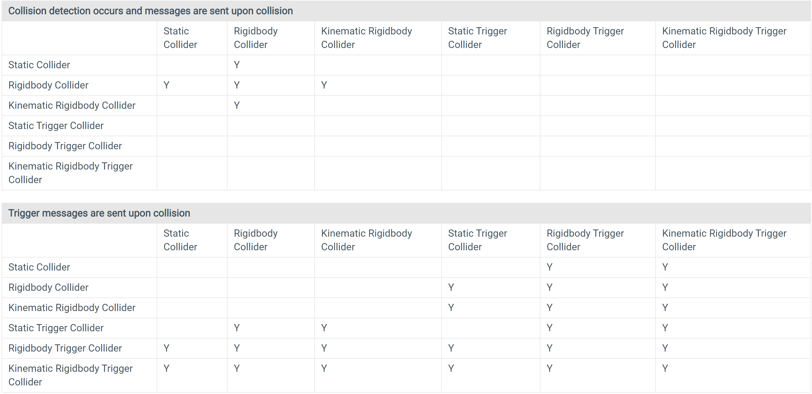

# 碰撞系统介绍

## 碰撞体 Collider
Unity中使用碰撞体来表达物理碰撞的计算中，Object的具体形状。碰撞体是不可见的，并且也不需要和游戏中Object的网格体具有一样的形状。

Unity下的碰撞体有以下几种：
- **Primitive Collider**：最简单的碰撞体，3D情况下，Unity为用户提供了Box、Sphere和Capsule三种；
- **Compound Collider**：由多个Primitive碰撞体构成的复合碰撞体，一般用于Primitive Collider无法近似Object形状的情况，仅适用于Rigidbody component，并且碰撞体需要放在GameObject的root层级；
- **Mesh Collider**：网格体碰撞体，会带来比较大的开销，需要谨慎使用。

碰撞体之间的交互方式主要由`Rigidbody component`的设置来控制，主要可以设置为以下三类：
- **Static Collider**：静态碰撞体，是一种具有碰撞体但是*没有Rigid component*的GameObject。一般用于场景中不会运动的物体，例如墙壁和地面等，静态碰撞体可以与动态碰撞体产生交互，但是静态碰撞体本身并不会受到碰撞响应的影响；
- **Rigidbody Collider**：动态碰撞体，与静态碰撞体相对，是一种带有*没有开启kinematic的Rigidbody组件*的GameObject，会受到碰撞响应的影响，其行为完全由物理引擎接管，是最常用的碰撞体；
- **Kinematic Rigidbody Collider**：是一种带有*开启kinematic的Rigidbody组件*的GameObject，这一类碰撞体不像Rigidbody Collider一样会对碰撞或者力有响应，而是使用脚本计算Transform Component来控制运动。通过改变Rigidbody Component中变量IsKinematic的值，可以让碰撞体在Rigidbody Collider和Kinematic Rigidbody Collider之间切换，一个常见的例子是布娃娃，正常情况下角色的肢体根据预设动画正常移动，当遇到碰撞或爆炸时，关闭所有肢体的IsKinematic，角色将被表现为一个physics object，以一个比较自然的动作被抛飞。

## 物理材质 Physics material
用于定义碰撞过程中，碰撞表面的一些行为，主要包括摩擦和弹性（反弹的力，不会发生形变）。

## 触发器 Trigger
用于触发一些碰撞事件，通过trigger object脚本中的OnTriggerEnter来定义。

## 碰撞回调函数
当碰撞第一次被发现的时候，会触发`OnCollisionEnter`函数；在“碰撞被检测到”到“碰撞对被分离”之间的过程中（可能会有好几帧），会触发`OnCollisionStay`函数；当碰撞对被分离，会触发`OnCollisionExit`函数。

Trigger可以调用类似的`OnTriggerEnter`、`OnTriggerStay`和`OnTriggerExit`函数。

这些回调函数的更多细节和用例在[MonoBehaviour](https://docs.unity3d.com/2021.3/Documentation/ScriptReference/MonoBehaviour.html)。

:::tip 注意事项

对于非trigger的碰撞，如果碰撞对中所有object都开启了动力学（`IsKinematic = true`），那么这些回调函数不会被调用。这样设计也合理，因为总需要一个东西来触发碰撞体的脚本。

:::

## 碰撞行为表
当两个对象发生碰撞时，根据碰撞对象刚体的配置，可能会发生许多不同的脚本事件。 下图给出了根据附加到对象的组件调用哪些事件函数的详细信息。 有些组合只会导致两个对象之一受到碰撞影响，但一般规则是物理不会应用于未附加 Rigidbody 组件的对象。

