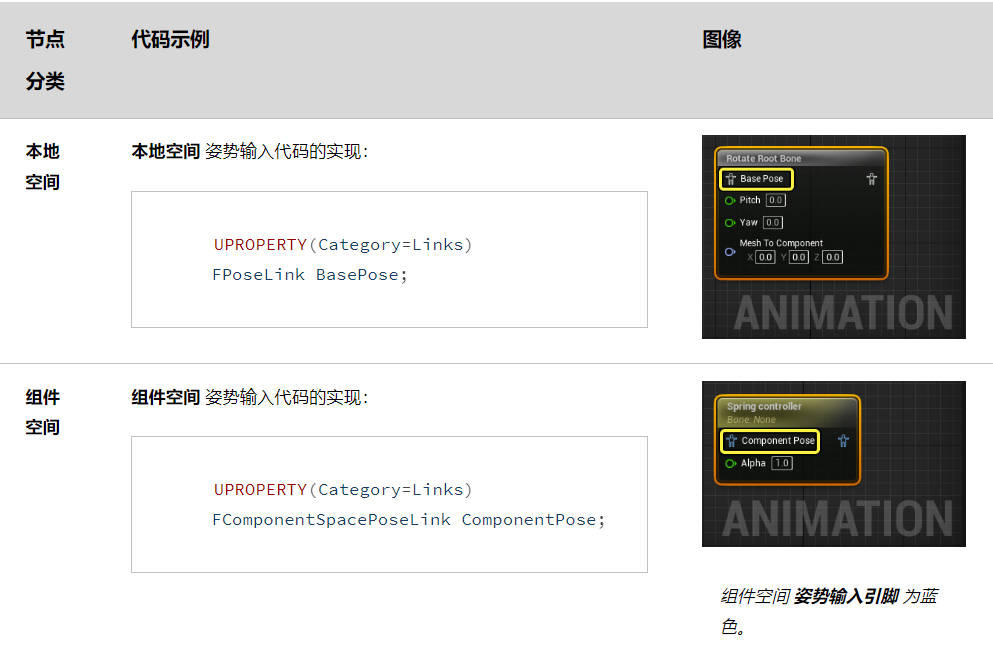
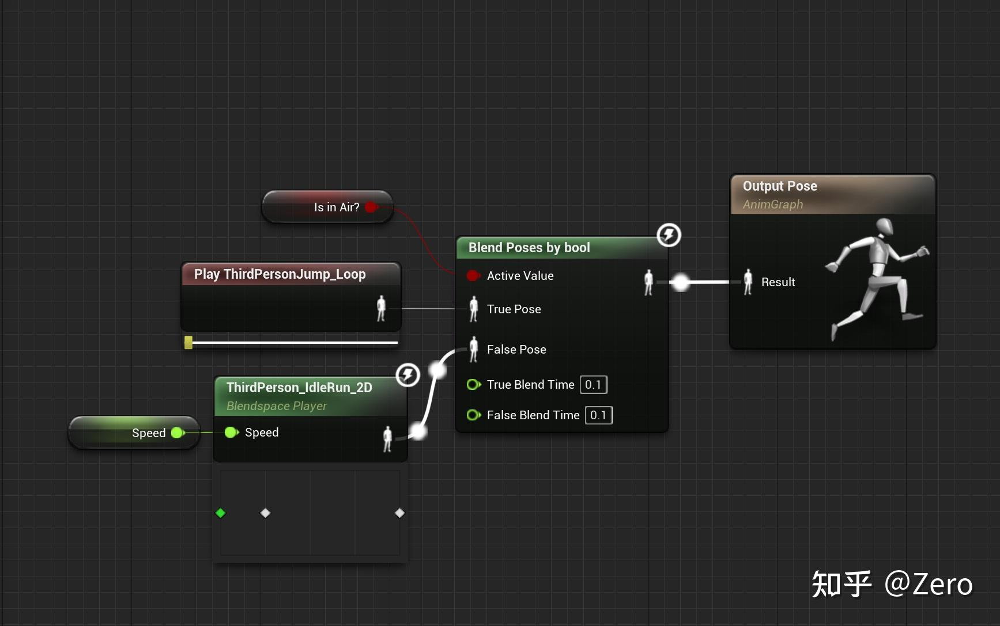

# 动画节点

动画节点在动画蓝图中用于执行多种操作，例如处理动画 Pose、混合动画姿势以及操控骨骼网格体的骨骼。

:::tip 动画蓝图

动画蓝图是动画实例（AnimInstance）的子类。可以这么理解，动画蓝图就是动画实例的可视化脚本。我们可以通过编辑动画蓝图来编写动画实例的逻辑。

:::

一个完整的动画节点包括两个基本组件：
- 一个运行时结构体（AnimNode），用于执行生成输出 Pose 所需的实际计算
- 一个编辑器容器类（AnimGraphNode），负责处理图标节点的视觉表现和功能，例如节点标题和上下文菜单

## 运行时节点组件
运行时结构体是一种**结构体**，派生自 FAnimNode_Base 类，负责初始化、更新以及在一个或多个输入姿势上执行操作来生成所需的输出姿势。它还会声明节点为执行所需操作需具备的输入姿势链接和属性。

一般来说需要：
1. Pose 输入

Pose 输入一般是通过创建 FPoseLink 或 FComponentSpacePoseLink 类型的属性来公开为一个Pin。其中 FPoseLink 用于处理 Local Space 的 Pose 时使用，例如混合动画。FComponentSpacePoseLink 在处理 Component Space 中的 Pose 时使用。例如：

<center>



</center>

一个节点还可以有多个 Pose 输入。另外，这两种类型的属性只能公开为输入引脚，无法被隐藏或者仅作为 Details 面板中的可编辑属性。

2. 属性和数据输入

可以通过 UPROPERTY 宏来声明自定义属性：
```cpp
UPROPERTY(Category=Settings, meta(PinShownByDefault))
mutable float Alpha;
```
使用特殊的 meta，动画节点属性可以公开为数据输入引脚，以允许值传递到节点：
- NeverAsPin：将属性作为AnimGraph中的数据引脚隐藏，并且仅可在节点的 细节（Details） 面板中编辑
- PinHiddenByDefault：将属性作为引脚隐藏。但是可以通过 Details 面板设置，将属性作为数据引脚在AnimGraph中公开
- PinShownByDefault：将属性作为数据引脚在AnimGraph中公开
- AlwaysAsPin：始终将属性作为数据点在AnimGraph中公开

## 编辑器节点组件
编辑器类派生自 UAnimGraphNode_Base，负责节点标题等视觉元素或添加上下文菜单操作。编辑器类应该包含一个公开为可编辑的运行时节点实例：
```cpp
UPROPERTY(Category=Settings)
FAnimNode_ApplyAdditive Node;
```
## 动画节点的运作

动画蓝图是以节点树的方式来组织动画的运行逻辑的。在运作的过程中，主要需要了解三个名词：

1. 更新（Update）

节点的Update用于根据Weight计算动画的各种权重。因为Weight会在下一阶段清空。

如果按照Epic的编写习惯，我们应该在Update里面拿到所有外部数据并且预计算，保证Evaluate可以直接使用。

2. 评估（Evaluate）

根据上一个节点的Pose，计算出输出到下个节点的Pose。

这是动画节点最重要的部分。正常来说我们应该把骨骼计算部分都放在这里。

注意Update和Evaluate都有可能运行在子线程上，除了读写AnimInstanceProxy外，操作其他东西都不是线程安全的，尽可能不要碰外部的UObject。

3. 根节点（Root）
   
也叫 OutPut Pose 节点。根节点是最重要的节点。对于用户来说，他是所有动画逻辑的输出节点。但是对于蓝图来说，他是整个蓝图节点的开始。AnimInstance 将从这里开始建立整个动画节点的树状联系。

以下面的蓝图举例：
<center>



</center>

1. 在 Update 的时候，执行 Root 的 Update
2. Root 找到连接到他的上一个节点，BlendPosesByBool 节点，执行他的 Update
3. BlendPosesByBool 节点的 Update 首先会读取所有 Pin 的值，这个节点来说主要是 Active Value
4. 然后根据 Value，执行对应节点的 Update，也就是上一个节点，BlendSpace Player节点的 Update
5. BlendSpacePlayer 的 Update 会读取 Speed 的值到属性里
6. 然后是 Evaluate，沿着同样的线路
7. 首先执行 Output 的 Evaluate，他会先执行上一个节点的 Evaluate
8. 也就是 BlendPosesByBool 的 Evaluate，这里他也会先执行当前激活的节点的 Evaluate，也就是 BlendSpacePlayer 的 Evaluate
9. BlendSpacePlayer 的 Evaluate 很简单，根据输入的参数，从 BlendSpace 里面输出一个混合的 Pose
10. 然后回到 BlendPosesByBool，如果有混合时间而且处于混合状态，他会把两个 Pose 按照比例混合再输出，如果没有，则直接原样输出其中一个 Pose，当前是 BlendSpace 的输出
11. 最后的Output节点把前面的Pose输出，大功告成