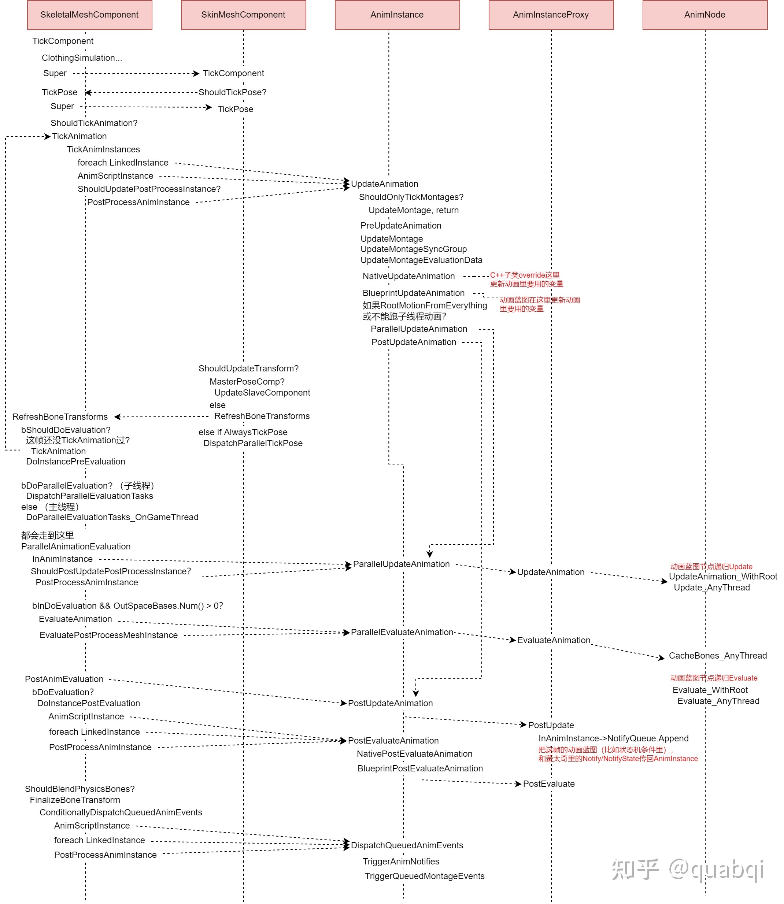
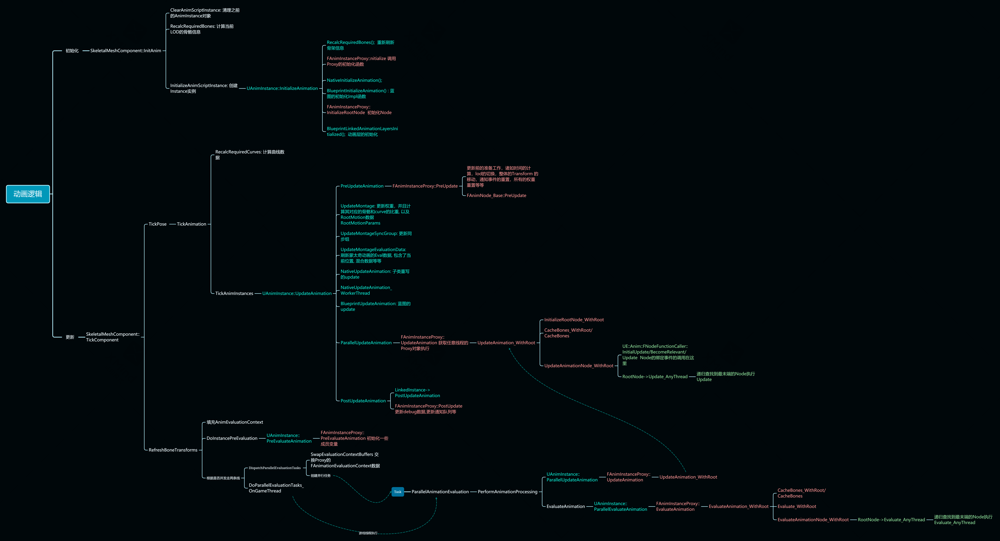

# 骨骼动画

> 参考资料：
> 
> UE4/UE5 动画的原理和性能优化：[link](https://zhuanlan.zhihu.com/p/545596818)

## 骨骼动画的思想
一个Mesh想要动起来，那么就需要去对每个顶点做Transform(位移/旋转/缩放)，那么每一帧都存这么多Transform，1秒24帧（或更多），一整段动画要存很多数据量，所以就有了骨骼这个概念。

骨骼这个概念，本质上就是压缩相同顶点的Transform的一种方式。具体来说，就是把Mesh上一部分的顶点和其中一个或多个骨骼做绑定，那么我们只要记录这个骨骼的Transform就好了。Mesh上的顶点会有对应骨骼的weight，每一帧只要将对应的骨骼的Transform做一个加权求和就能够得到该顶点的Transform。

所以整个动画分成两个阶段：
1. 现在**游戏线程**中的`TickComponent`里面求得当前帧的Pose（Pose：每个骨骼的Transform）
2. 在**渲染线程**中根据最终Pose做CPUSkin或GPUSkin算出顶点信息，并进行绘制

先骨骼，后render mesh（skinned mesh）。

:::tip TickComponent

TickComponent是UActorComponent类的成员函数，该函数会在每一帧被调用，以计算对应的组件在这一帧中的行为。

:::

<!-- ## Game Thread

 -->

UE 中作为骨骼动画载体的是 SkeletalMeshComponent，SkeletalMeshComponent 继承自 SkinnedMeshComponent。在 SkeletalMeshComponent 创建时，会创建一个 AnimationInstance，这就是主要负责计算最终 Pose 的对象，而我们制作的 AnimationBlueprint （动画蓝图）也是基于 UAnimationInstance 这个类的。（目前 AnimationInstance 的逻辑慢慢地开始迁往 AnimInstanceProxy，目的是动画系统的多线程优化）

在 SkeletalMeshComponent 进行 Tick 时，会调用 TickAnimation 方法，然后会调用 AnimationInstance 的 UpdateAnimation() 方法，此方法会调用一遍所有动画蓝图中连接的节点的 Update_AnyThread() 方法，用来更新所有节点的状态。

然后后续根据设置的不同会从 Tick 函数或者 Work 线程中调用 SkeletalMeshComponent 的 RefreshBoneTransforms() 方法，此方法进而会调用动画蓝图所有节点的 Evaluate_AnyThread() 方法。Evaluate 就是实际计算出所有骨骼的 Transform 信息的步骤。计算得到的 Pose 最终会给到渲染线程，并且存在 SkeletalMeshComponent 上。



## 初始化
动画蓝图的初始化要从SkeletalMeshComponent的注册开始, 会调用到InitAnim()函数。函数中主要做了这么几件事：
1. `ClearAnimScriptInstance();` 清理之前的 AnimInstance 对象
2. `RecalcRequiredBones();` 根据Lod计算特定的骨骼信息, 数据来自 FSkeletalMeshRenderData, 然后如果有物理资产 PhysicsAsset 会刷新 PhysAssetBones
3. `InitializeAnimScriptInstance();` 创建指定的动画蓝图实例对象
4. 如果符合条件，会执行一次 `TickAnimation()` 和 `RefreshBoneTransforms()`

## 动画更新
首先我们需要知道, 动画更新默认是多线程的。以下讨论都基于多线程动画更新：

### SkeletalMeshComponent
动画更新要从 `SkeletalMeshComponent::TickComponent()`开始, SkeletalMeshComponent相对于其父类USkinnedMeshComponent, 在Tick中额外多了一些布料和物理相关的一部分逻辑。

Tick 中主要执行了：
- `TickPose()` ：要作用就是刷新动画蓝图和相关Node的数据, 为后面的骨骼更新做准备
- `RefreshBoneTransforms()`：作用就是刷新骨骼数据（通过调用 `ParallelEvaluateAnimation()` 来并行执行 Evaluate 任务, 然后提供给骨骼模型做最终的渲染


### AnimNode
主要看一下 FAnimNode_Base 里的几个多线程虚函数：

```cpp
virtual void Initialize_AnyThread(const FAnimationInitializeContext& Context);
virtual void CacheBones_AnyThread(const FAnimationCacheBonesContext& Context);
virtual void Update_AnyThread(const FAnimationUpdateContext& Context);
virtual void Evaluate_AnyThread(FPoseContext& Output);
virtual void EvaluateComponentSpace_AnyThread(FComponentSpacePoseContext& Output);
```

#### Initialize_AnyThread
进行初始化，会在很多地方调用到, 比如编译以后也会调用一次, 在 `USkeletalMeshComponent::OnRegister` 时也会通过 Proxy 调用 `InitializeRootNode_WithRoot()` 一路初始化, 还有状态机 `SetState()` 时一路通过 LinkedNode 找到每个节点进行初始化等等。

#### CacheBones_AnyThread
在骨骼信息发生变换的时候引用到, 比如LOD变化时就会调用到. 主要用于刷新该节点所引用的骨骼索引。

#### Update_AnyThread
这个调用就比较频繁了, 在 TickPose 和 RefreshBoneTransform 的过程中都可能被调用

这个函数通常用来对刷新骨骼位置所需要的变量进行计算

#### Evaluate_AnyThread
用来计算并刷新 Local 空间的骨骼数据的函数, 一般我们自定义动画节点通常会重写这个函数大作文章

#### EvaluateComponentSpace_AnyThread
同上, 但是是在组件空间的, 两者只选其一即可