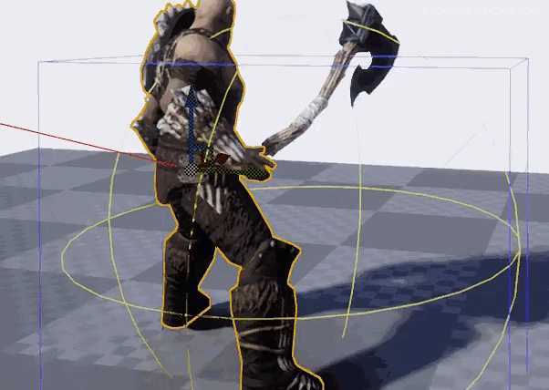
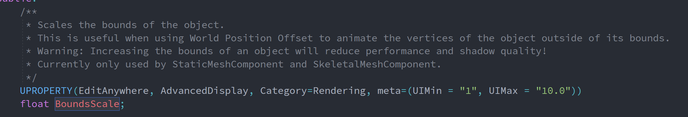
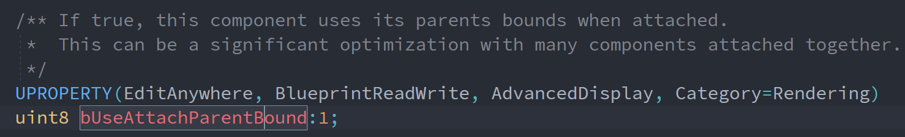
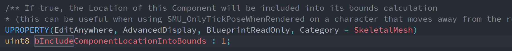
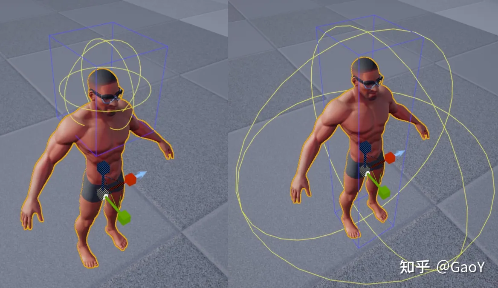
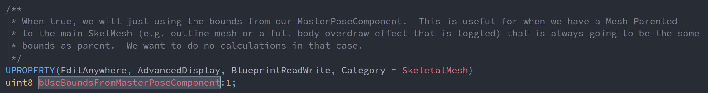
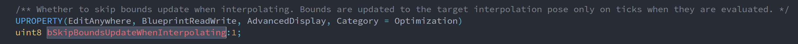
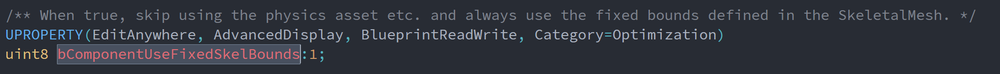

# Bounds

> 阅读资源
>
> 【UE4】Bounds 详解：[link](https://zhuanlan.zhihu.com/p/407569406)
>

Bounds是用于做可见性剔除和LOD计算的。

## 可见性剔除
UE中为了减少计算，使用AABB（类型为FBoxSphereBounds）来包围物体，旋转物体时能够发现Bounds的大小也会随之变化，使得其始终与世界的XYZ平行。在UE中，AABB Bounds用蓝色长方体来表示，如果长方体的八个顶点都不在视图中，物体就会被剔除（不渲染）。例如下图，奎托斯的斧子没有消失是因为人物和武器没有使用同一个bound来做剔除。

从而Bound的大小也挺讲究的，太小，可能稍不注意整个Mesh就看不见了；太大，不管怎么移动引擎都需要渲染其对应的Mesh，增加了计算。

## LOD
Mesh LOD 的计算和配置其实不是真的 Distance，而是 Screen Size，屏幕占比，比如屏占比1.0到0.5都是LOD0，即最高等级LOD，0.5到0.3是LOD1，即粗糙一点的LOD，以此类推。

## Bounds的设置

1. BoundsScale
    
    - 所在类：UPrimitiveComponent
    - 路径：Engine\Source\Runtime\Engine\Classes\Components\PrimitiveComponent.h
    - 用途：在StaticMeshComponent和SkeletalMeshComponent上才生效，能够修改Bounds的缩放倍率

2. bUseAttachParentBound
    
    - 所在类：USceneComponent
    - 路径：Engine\Source\Runtime\Engine\Classes\Components\SceneComponent.h
    - 用途：设置为true后，该组件就不自己计算Bound，而是直接使用parent的Bound，主要用于性能优化。如果最高层的Parent Mesh也使用了UseAttachParentBound，那么就会使用RootComponent的Bound，一般来说是一个胶囊体的Bound，其计算可见UCapsuleComponent::CalcBounds。如果上面那个动图的斧子也用了UseAttachParentBound，那么它就会和奎托斯同时被剔除

3. bIncludeComponentLocationIntoBounds
    
    - 所在类：USkeletalMeshComponent
    - 路径：Engine\Source\Runtime\Engine\Classes\Components\SkeletalMeshComponent.h
    - 用途：在计算USkeletalMeshComponent的Bound的时候，如果发现该变量为true，就会将组建的Component Location重新计算Bounds。例如一个人的模型，只开了头的Bound，那么该组件的Bound只能包括头，如果将该变量设置为true，那么Bound就会变大。
    

4. bUseBoundsFromMasterPoseComponent
    
    - 所在类：USkinnedMeshComponent
    - 路径：Engine\Source\Runtime\Engine\Classes\Components\SkinnedMeshComponent.h
    - 用途：如果标记为true，会在USkinnedMeshComponent::CalcMeshBound计算SkinnedMesh组件的Bound时候使用MasterPoseComponentInst的Bound

5. bSkipBoundsUpdateWhenInterpolating
    
    - 所在类：USkeletalMeshComponent
    - 路径：Engine\Source\Runtime\Engine\Classes\Components\SkeletalMeshComponent.h
    - 用途：如果设置为true，那么只会在tick计算完成后更新Bound，中间插值的时候就不更新了

6. bComponentUseFixedSkelBounds
    
    - 所在类：USkinnedMeshComponent
    - 路径：Engine\Source\Runtime\Engine\Classes\Components\SkinnedMeshComponent.h
    - 用途：如果设置为true，那么该组件就会使用一个固定的Bound。这会带来两个影响：1）Bound不会根据Mesh的旋转等操作更新，减少计算量；2）计算得到的Bound会比自动的要大，这是为了确保Mesh能够被包住

