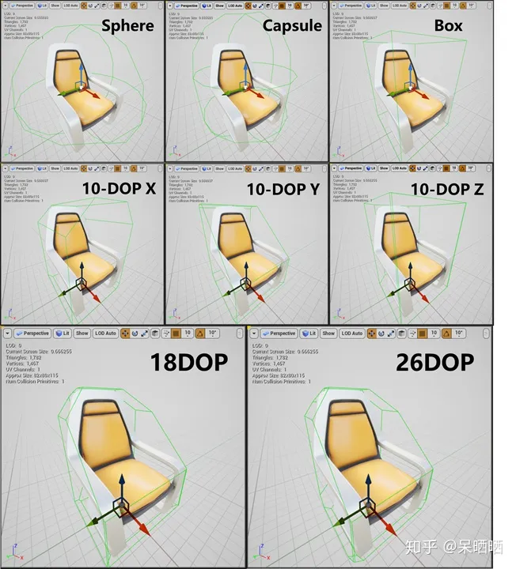

# UE的碰撞与检测

## 碰撞检测

### 碰撞检测设置
在 UE 中，每个参与碰撞的物体都包含了两个属性：碰撞通道（Object/Trace Channel）以及其与其他 Channel 之间的交互类型，交互类型可以分为三类：
- Ignore-可穿透且无任何事件通知
- Overlap-可穿透且有事件通知
- Block-不可穿透且有事件通知

其中交互类型是一张表，在 UE 中叫做 Preset，其中记录了当前这个物体和各种通道的物体之间是Ignore、Overlap还是Block。

发生碰撞的两个物体，只要有一个物体将碰撞对向的类型设置为 Ignore，那么就不会触发任何事件和物理现象。如果两个碰撞对象都互相将对方设置为 Block 时，就会产生物理上的阻隔。其他情况下则都是 Overlap，仅会产生事件，但是不会阻隔。

另外，Preset 中还有一个选项以确认启用碰撞的类型，有四类：
- No Collision（没有碰撞）：在物理引擎中此形体将不具有任何表示。不可用于空间查询（光线投射、Sweep、重叠）或模拟（刚体、约束）。此设置可提供最佳性能，尤其是对于移动对象。
- Query Only（仅查询无物理碰撞）：此形体仅可用于空间查询（光线投射、Sweep和重叠）。不可用于模拟（刚体、约束）。对于角色运动和不需要物理模拟的对象，此设置非常有用。通过缩小物理模拟树中的数据来实现一些性能提升。
- Physics Only（仅碰撞无物理查询）：此形体仅可用于物理模拟（刚体、约束）。不可用于空间查询（光线投射、Sweep、重叠）。对于角色上不需要按骨骼进行检测的模拟次级运动，此设置非常有用。通过缩小查询树中的数据来实现一些性能提升。
- Collision Enabled（启用碰撞物理和查询）：此形体可用于空间查询（光线投射、Sweep、重叠）和模拟（刚体、约束）。

### 碰撞检测方法
UE 中的碰撞检测主要分为三层：
- World 层：最靠近业务需求的层次，已搭建好的物理系统环境，并提供一系列可直接调用的接口
- Interface 层：也是接口封装层，对下封装好第三方物理插件，并负责搭建好物理系统环境
- Plugin 层：具体的物理引擎插件，例如 UE4 的 PhysX、UE5 的 Chaos 等等

主要使用的就是 World 层的接口。
1. 射线碰撞检测

UE中的射线查询主要使用 UWorld::LineTraceSingleByChannel 和 UWorld::LineTraceSingleByObjectType 函数进行。
其中前者通过 Trace Channel 进行查询，后者通过 Object Type（也就是 Object Channel）进行查询。

除了打射线，还可以打具有形状的射线（Sphere、Box、Capsule等等）。

2. 重叠碰撞检测

一般使用 UWorld::OverlapMultiByChannel 函数。函数中要求输入一个 FCollisionShape，FCollisionShape 一般支持 Sphere、Capsule、Box 和 Line，个人一般用Box。函数能够检测得到与该 CollisionShape 重叠的碰撞物，以 FOverlapResult 的形式返回。

检测到以后，那么就可以通过 FHitResult/FOverlapResult 的 `GetComponent()` 函数拿到碰撞体的 PrimitiveComponent。再通过 PrimitiveComponent 的 `GetBodyInstance` 函数拿到碰撞体的实例 BodyInstance。

## 碰撞体
我们可以从外部导入 Mesh 的碰撞体，也可以在 UE 中为导入的 Mesh 自动生成可用于游戏的碰撞体。这种自动生成的碰撞体分为两种，简单碰撞体和复杂碰撞体。

### 简单碰撞体
简单碰撞体就是用基础形状（Box、Sphere、Capsule、Convex Shape 等等）来定义物体边界的 Collision Mesh。除了这些基本形状，还有一种名为KDOP（K Discrete Oriented Polytope，K-离散有向多面体）的简单碰撞体。这种碰撞体会生成K组轴对称的平面，并将其形状尽可能地贴近所选的Mesh。

另外还可以使用凸包分解（Auto Convex Collision）来生成凸包体碰撞体。

除了在引擎重生成，还可以从外部导入自定义碰撞体，这个时候需要遵循一定的命名规范：
- UBX_[Mesh Name]: Box 碰撞体
- USP_[Mesh Name]: Sphere 碰撞体
- UCX_[Mesh Name]: Convex Shape 碰撞体

将这些符合命名规范的碰撞体和 Mesh 一起导出为 FBX，然后导入到引擎中。导入后，UE 会找到碰撞体，将其与实际的 Mesh 分离，并转换为 Collision Mesh。

### 复杂碰撞体
复杂碰撞体即该 Mesh 本身。在 StaticMesh 编辑器的细节面板中，我们可以在 Collision->Collision Complexity 中对引擎生成碰撞体的复杂度进行设置，以便进行不同精度的碰撞查询，共有四个选项：
- Project Default-项目默认设置，在 Project Setting->Engine->Physics->Simulation 中可以找到
- Simple And Complex-同时生成简单碰撞体和复杂碰撞体。简单碰撞体用于常规的场景查询和碰撞测试；复杂碰撞体用于复杂场景查询。
- Use Simple Collision As Complex-仅创建简单碰撞体，用于场景查询以及碰撞测试。
- Use Complex Collision As Simple-仅创建复杂碰撞体，用于场景查询以及碰撞测试。但此时无法对其进行模拟。